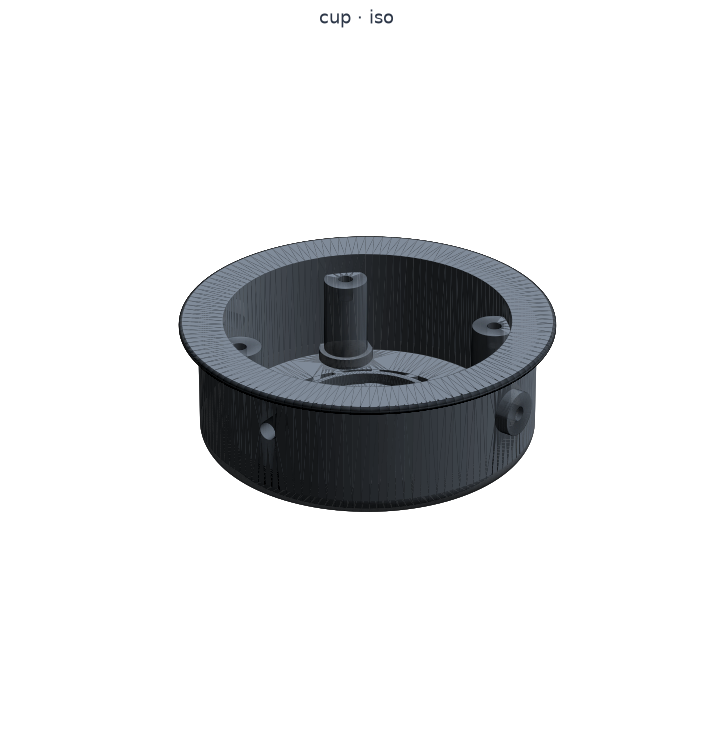

# Daily Driver — Design Log

For an open design, the log *is* part of the product. Every decision, every
measurement, every iteration goes here so anyone can follow the reasoning, not
just the result. Newest entries at the top.

---

## 2026-06-26 — Fit coupons, driver-clamp soft-round, build123d port deferred

Build **12/12** (two new coupons), gate **0 HARD / 1 SOFT** (the pre-existing yoke
stop-slot web).

**build123d yoke port — DEFERRED (not now).** The open "soft-round yoke" item is gated
on the full build123d pipeline port already scoped in `docs/cadquery-build-notes.md`
(2026-06-25): build123d builds the round-section yoke this OCC build can't, but it's a
*planned* port of every part + build/gate/assembly into a clean isolated venv — not a
one-part scramble (installing build123d into this venv pulls OCP 7.9.3 alongside the
pinned 7.8.1 and silently swaps the kernel under the verified build). Decision: the yoke
stays the gate-clean flat bracket; the port is a dedicated future effort. Form waits on
function — nothing is print-verified yet, so this session went to fit coupons instead.

**Fit coupons (new `parts/coupon.py`, two ACCESSORY pieces).** Small printable QA parts
that isolate a toleranced interface so it's checked against real hardware BEFORE a full
cup/baffle print. Every FIT dimension DERIVES from the real interface params (the coupon
can't drift from the part it validates); only coupon scaffolding (`coupon_*`) is local.

- `driver_coupon` — the baffle's BACK driver interface: recess Ø39.8 × 3 (the 39.5
  driver nests, 0.3 clr), 3 standoff bosses (h2 = body 5 − recess 3) at the Ø60 clamp
  BCD with M3 insert bores. The real `driver_clamp` ring bolts on → confirms the
  rear-rim capture + standoff height against the real driver. Central recess puck + 3
  spokes (trims the full Ø77 plate to just the bits under test). 1 solid, ~6 cm³.
- `pad_coupon` — FULL grip ring at OD 91.44 + the DT770 lip (ext 5.08 × 2.0). Full ring,
  not an arc: "does the body grip ~91.4?" is a HOOP question; an arc lets the elastic
  skirt splay and under-reads the grip. 1 solid, Ø101.6 brim × 15.

Coupons get STL+STEP but are skipped from the web GLB/render (QA tools, not gallery).

**Driver clamp soft-round (maker request).** Rounded the sharp 90° corners: necked the
posts (`driver_clamp_post_width` 6 < ear pad 9) so the post↔ring and post↔pad junctions
are real reflex corners, blended with a 3D fillet, plus a perimeter rim roundover. This
OCC build's ceiling here is tight — an empirical probe found the junction fillet VALID
only at **0.8 mm** (0.9–1.1 silently invalidate the solid, ≥1.2 hard-fail), rim roundover
at **0.6**. Locked those, and made the fillet application defensive (`_safe_fillet`: keep
only if the solid stays valid, else skip). Subtle but real soft; that a bigger radius
won't take is one more reason the build123d port (its fillets hold where OCC's refuse)
earns its place.

---

## 2026-06-26 — Driver MEASURED (39.5 mm OD, 5 mm tall, magnet 27×3)

Real driver measured, replacing the REF estimates. `driver_od` 42 → **39.5**,
`driver_body_depth` 8 → **5**, magnet **Ø27 × 3** (was 26 × 5). Cascade: the diaphragm/
dome dropped to **34** (must be < the 39.5 frame) and `driver_seat_ledge` 3.5 → **2.5**
so the derived aperture (od − 2·ledge = 34.5) still clears the 34 diaphragm. Clamp
follows the thinner driver: recess depth 3 → **2**, standoff 5 → **2** (= body_depth −
baffle recess_depth). Mockup updated (basket Ø39.5 × 5 + magnet behind; the wider front
flange dropped since the outermost dia IS the 39.5 rim). Build 10/10, gate 0 HARD / 1
SOFT; the assembly stack (driver seated, clamp on the rear, magnet through the centre)
still reads. Diaphragm + the clamp recess/standoff stay estimates pending a fit print.

---

## 2026-06-26 — Driver mockup + clamp-ring orientation fix + baffle back to 4 screws

Maker review of the one-piece cup. Build 10/10, gate 0 HARD / 1 SOFT.

- **Baffle screws 3 → 4** (maker's choice; reverts my "lighter" 3). The 6 small holes
  the maker saw AROUND the driver are the controlled VENTS (`baffle_vent_count=6`,
  Ø2) in the flat ring between the aperture and the bolt circle — they connect the
  front ear-cavity to the rear cup-cavity (a minor tuning knob; largely redundant with
  the wide-open lattice back, so a candidate to drop in the acoustic loop).
- **Driver MOCKUP added** (`parts/driver.py`, REFERENCE — not printed): a representative
  40 mm dynamic driver (frame + mounting flange + dome + rear magnet) so the
  driver↔baffle↔clamp fit reads in the assembly.
- **Clamp-ring orientation FIXED.** It was a proud LIP pressing the flange (wrong, per
  the maker). Now it's a RECESS: the driver's rear nests slightly INTO the ring, the
  recess wall captures the driver's outer edge, and the recess floor (an inner
  shoulder) bears on the back of the frame rim — pressing the driver forward into the
  baffle. The magnet protrudes back through the open centre.
- **Clamp now IN the assembly** (was accessory-only): posed behind the driver, bolting
  to baffle-back STANDOFF bosses that reach back ≈ `driver_body_depth − driver_recess_
  depth` to meet the ring at the driver's rear. Added driver + clamp to the parts
  viewer's earcup group. Verified the stack geometrically (driver seated, clamp on the
  rear rim, magnet through the centre, standoffs meeting the ears).
- Driver-fit dims (flange/magnet/standoff/recess depth) are REF / driver-measured-pending.

---

## 2026-06-26 — Reverted the separating earcup → back to ONE-PIECE cup

The maker reconsidered the modular split and decided the tradeoffs weren't worth it:
the printed THREAD is the finickiest thing in the build (FDM threads need a clearance
coupon, can cross-thread, wear), and the whole split added real assembly/seal
complexity for a benefit (swap open↔sealed / change damping without reprinting the
front) that doesn't justify it for a build-once product — especially since damping is
already reachable from the FRONT (pull the baffle + driver). So: back to a one-piece
cup. (The modular Stages 1/1b/2/3 — split, lattice grille, thread, O-ring seal — and
their eval reasoning stay in git history + the entries below if it's ever revisited.)

**Removed:** the `frame`/`module` split + `_frame_module_split` (cup is one printed
part again); the single-start thread + `parts/thread.py` + the `joint_thread*` params;
the Stage-3 collar + axial O-ring groove + bottoming shoulder + all `joint_*` params;
the joint + Stage-3 + forward-pivot gate checks; the stale frame/module GLBs + renders.
`cq_warehouse` stays pinned in dev reqs (still used for the heat-set-insert viz).

**Kept (all independent of the split):** the triangular ×3 lattice grille + flush
logo, the buttressed baffle bosses (now floored on the back floor again, full-height +
base flare), `baffle_screw_count=3`, the 3-bolt driver clamp ring, the Grado-style
yoke post + thumbscrew height adjust, the 4 in cup OD + lip.

**Pivot moved back to mid-height** (`cup_total_height/2`) — it was only forced forward
to land on the frame for the split; mid is the balanced clamp position again.

**Open/sealed + damping, the one-piece way:** damping is set/changed from the FRONT
(baffle + driver off, then the clamp ring back on); open vs sealed = two cup variants
you reprint (the grille is integral). Build 9/9, gate 0 HARD / 1 SOFT.

---

## 2026-06-26 — Stage 3: axial O-ring seal + hard bottoming shoulder

The frame↔module joint now SEALS for the closed-back variant. Per the eval, the
O-ring squeeze is set by GEOMETRY, not thread torque. Build 10/10, gate 0 HARD /
1 SOFT; frame + module each one valid solid.

- **Local COLLAR** (`joint_collar_diameter=98`, ≤ the 101.6 lip envelope): both parts
  bulge the OD at the joint band to make a seal face OUTBOARD of the thread — the
  6.7 mm wall is fully spent on the thread, so a 3.3 mm axial groove has nowhere else
  to go (the eval anticipated this collar). Module flange below the parting plane,
  frame collar above; their flat faces meet at z=parting.
- **Axial O-ring** (not radial — a radial gland leaks along FDM layer lines):
  AS568 dash-2xx, **CS 2.62**, mean seal Ø **92**. The GROOVE is on the MODULE's
  up-facing flange so it prints **floor-up** (the only FDM-airtight sealing face).
  Groove **depth 2.1 → ~20% squeeze**, **width 3.3 → 78% fill** (< 85%, no hydraulic
  lock). The OPEN lattice module just omits the O-ring; the SEALED module fits it.
- **Hard bottoming SHOULDER:** the collar lands either side of the groove (in 1.0 /
  out 1.4 mm) bottom plastic-to-plastic; the spigot top is held `joint_seat_clearance`
  (0.3 mm) short of the socket ceiling so this z=parting shoulder is the stop. So the
  squeeze (and the cavity volume) is capped by geometry — independent of how hard the
  thread is twisted.
- **Gate +5:** `joint-gasket-squeeze` (12–25%), `joint-groove-fill` (≤85%),
  `joint-shoulder-lands` (≥0.8 both sides), `joint-collar-within-lip` (≤101.6); the
  frame/module manifold checks confirm the collar+groove still build as one solid.
- **Open / not verified:** needs a print + the actual sourced O-ring to confirm the
  seal and the seated squeeze (the eval's Stage-3 seal coupon — water/pressure or an
  REW low-freq sweep). The collar adds a joint band (a few grams) — the cost of the
  integrated seal; a smaller O-ring (CS 1.78) would shrink it if weight bites. Driver
  clamp + thread-coupon prints still pending before this is print-and-assemble ready.

---

## 2026-06-26 — Driver clamp ring, buttressed bosses, Grado-style yoke height adjust

A batch of maker-driven mechanical changes (3 committed checkpoints). Build 10/10,
gate 0 HARD / 1 SOFT throughout.

**Driver clamp ring (new part, `driver_clamp`).** The maker wants the driver held by
a 3-ear clamp ring (their exhaust-flange-style prototype) instead of just dropping it
in. `make_driver_clamp` is a 3-ear ring with a raised inner LIP that presses the
driver's mounting flange and an open centre clearing the magnet; it bolts to 3 M3
heat-set inserts on the baffle BACK (small bosses at bcd 60 / r30), independent of
the baffle→frame mount. The bolt circle sits BETWEEN the vents (r26) and the frame
holes (r35), and the 3 clamp bosses (0/120/240) interleave with the 6 vents (offset
30°) → 21° clear. Gate: manifold + bcd-band + clears-vents + catches-flange. It's an
ACCESSORY (printed, gallery-shown; not posed in the assembly since the driver itself
is a bought part not modelled). Driver-fit dims are driver-pending.

**Baffle screws 4 → 3.** Lighter, a stable 3-point plane, matches the 3-fold clamp.
(The maker counted "6 holes" — those are the 6 acoustic VENTS; the mount screws were 4.)

**Frame baffle-bosses buttressed.** The maker flagged the bare boss columns as
snap-off fragile. They're now built as a column + a wider base FLARE that merges into
the cup wall over a much wider arc than the thin lens, built solid THEN bored
(round-before-cut — a base fillet here makes an invalid solid). `baffle_boss_diameter`
10 → 12 (deeper embedment + thicker bore wall). Reach (col 41 / flare 42.5) clears the
female-thread valley.

**Yoke height adjustment — Grado HP1000-style post + thumbscrew (`#4`).** Replaced the
fixed swivel hub/bore with a real vertical SIZE adjustment: the yoke carries a round
POST (Ø8) that SLIDES through the slider block, locked by an M4 THUMBSCREW pressing
the post (friction, no detent — like Joe Grado's HP1/HP1000; Beyer's friction-clip in
the block is the noted alternative). The round post in the round bore also lets the
cup SWIVEL (fore-aft seal conform) when the screw is loose; tightening locks both
height + swivel. `slider_block_depth` 16 → 18 so the central post bore keeps a ≥2 mm
wall to the bow-tab seat. Gate: `yoke-post-structural`, `slider-postbore-wall` (2.8),
`slider-mount-clears-postbore`; the old swivel-hub checks retired. BOM gains the clamp
screws + the M4 thumbscrew/insert.
- **Trade-off logged:** a single round post + side thumbscrew locks height AND swivel
  together; if a free-in-use swivel proves worth it, add a separate swivel joint below
  the slide (or a height-only key). Set-and-lock is the HP1000 norm and fine for now.
- **Not verified:** the post slide fit (0.4 mm) + the thumbscrew grip want a print;
  the clamp's exact lip/standoff is driver-measured-pending.

---

## 2026-06-26 — Stage 2: single-start coarse thread on the joint (twist-lock)

The frame↔module joint now carries a real printable THREAD (was a plain slip
register): the module spigot gets the EXTERNAL/male thread, the frame socket the
INTERNAL/female thread, via `cq_warehouse` `IsoThread` (single-start, coarse). Build
9/9, gate 0 HARD / 1 SOFT. Both parts build as ONE valid solid — the eval-flagged
union fragmentation did NOT occur at this sizing.

- **Sizing — Ø86 / pitch 3, NOT the eval's Ø84 / pitch 4.** In THIS shiplap the
  6.7 mm wall must hold: male core + thread depth + clearance + frame outer wall.
  At Ø84/pitch-4 the male solid core collapsed to ~0.8 mm (well under the 2 mm
  floor). A coarser-but-SHALLOWER pitch-3 thread at Ø86 (r43) is the sweet spot —
  verified in the venv: male core **2.38**, frame wall **2.37**, female crest **41.7**
  (clears the baffle bosses at r40). New params: `joint_interface_radius` 42 → **43**
  (the thread major radius + lap interface), `joint_thread=True`, `joint_thread_pitch=3`.
- **Fit:** 0.35 mm radial clearance — female valley = male major + 2·clr (Ø86.7). The
  spigot core is sized just past the external thread root (`min_radius + 0.15`) so the
  thread fuses to the core as one solid.
- **Import-guarded (`parts/thread.py`):** the thread wraps `IsoThread` (re-wrapped as a
  plain `cq.Solid` so OCC transforms don't re-invoke its constructor). If `cq_warehouse`
  is absent or a thread won't build, the joint DEGRADES to the plain slip register
  (still one valid solid) — VERIFIED — so build + gate stay green on core deps.
  `cq_warehouse` PINNED to its verified commit in `requirements-dev.txt`.
- **Gate:** `joint-module-spigot-wall` is now thread-aware (checks the solid core@root,
  not the crest envelope); added `joint-female-clears-bosses`. The frame/module
  one-valid-solid manifold checks remain the real go/no-go for the thread.
- **Still open / NOT verified:** the thread fit is unprinted — needs a 2–3-turn male+
  female COUPON print to confirm it hand-threads at the 0.35 clearance (the eval's
  Stage-2 coupon). The hard bottoming SHOULDER + axial O-ring GASKET are Stage 3. The
  3-lug bayonet remains the live fallback if a print shows the thread won't seat.

---

## 2026-06-25 — Per-part GLBs for the website's 3D parts gallery

`build.py` now exports a per-part GLB to `docs/models/<part>.glb` (committed,
Pages-served) for every printed + accessory part, alongside the existing assembly
GLB — so the makerphones website's parts gallery can show each part in 3D (not just
the static render poster), letting the maker spin/inspect individual geometry. A
neutral mid-grey colour so parts read in the viewer's neutral environment (the dark
charcoal was hard to see). No geometry change; build 9/9. (Paired with website-side
viewer upgrades: brighter lighting, a bigger explode, a fullscreen button, and the
per-part 3D cards — those live in the makerphones repo, not here.)

---

## 2026-06-25 — Bottom-seal homework: asymmetric pins vs asymmetric pads

The maker asked us to do the homework on the IDEAL yoke↔cup pivot placement —
front-to-back and ASYMMETRIC pin positioning — as a possible alternative to the
expensive/hard-to-source asymmetric earpads makers use to fix the weak bottom seal. A
focused 4-lens adversarial workflow (corrected kinematics, pads-vs-geometry, prior
art, this-design) answered it. (This also CORRECTS a DOF mislabel in the earlier
pivot/seal entry: the TILT DOF — rotation about the front-back axis — IS the
top-vs-bottom seal adjuster; the SWIVEL is front-vs-back.)

- **Fore-aft placement: wrong knob.** Fore-aft of the cup↔yoke attachment is the
  SWIVEL's domain (front-vs-back balance), orthogonal to the bottom (top-vs-bottom)
  seal. Don't chase the bottom seal with it.
- **Asymmetric pins ALONE: do nothing.** A free, low-friction hinge self-seats to the
  one angle of ZERO net moment, so any static axis change (off-centre, canted, or a
  built-in toe-in *at rest*) only relocates the REST ANGLE — the hinge launders the
  bias away. Keep the pins EXACTLY COLLINEAR (a bearing/anti-bind requirement, NOT a
  seal lever). Put all seal asymmetry in the STOP / SPRING / DETENT, never the pin line.
- **What actually holds bottom pressure** (ranked): (1) a light SPRUNG/preloaded
  toe-in about the existing M3 axis (~150–250 N·mm → ~3–5 N bottom-rim force) — best,
  force-regulating, conforms across heads/glasses; (2) an ASYMMETRIC TOE-IN hard stop
  by re-clocking the existing `pivot_stop_slot` (~1.5–2°) — but a bare stop carries ~0
  load unless a preload or sub-centroid clamp drives the cup into it; (3) an asymmetric
  DETENT/friction (Bose US10334352B2 pattern) — position-holding, drifts; (4) biasing
  the CLAMP RESULTANT ~5–15 mm below cup centre via the slider/hub — front/back-neutral.
- **Can geometry replace an asymmetric pad? PARTIALLY.** It fixes a PRESSURE deficit
  (bottom touches but lightly) — so the expensive asymmetric pad is avoidable there.
  It CANNOT fill a SHAPE GAP (daylight at the jaw/temple/glasses); that needs added
  material — but the cheap in-house substitute is **cup-rim bottom loft** or a 2–3 mm
  **foam wedge shim** under the pad arc, NOT a custom pad. Open-back forgiveness (a
  small leak ≠ bass roll-off) makes symmetric-pad-plus-geometry viable here.
- **Hybrid-D needed? NO (reconfirmed).** Every held-pressure lever acts ABOUT the
  existing collinear axis at `pivot_boss_z=24`; none needs the axis relocated. Moving
  the axis forward/high is the hybrid-D move and only changes rest angle on a free
  hinge — the least useful lever. Mid-split stands.
- **DIAGNOSE FIRST (print-dependent), so nothing is implemented yet:** print the
  symmetric Dekoni + leak/pressure-paper the bottom rim to tell PRESSURE deficit from
  SHAPE gap; that decides whether we add the sprung toe-in (RANK 1) or rim loft. When
  we do: PREREQUISITE = re-clock `pivot_stop_slot` to the worn rest pose (still
  symmetric about −Z / ~90° off per the assembly flag) before any toe-in. Planned
  params (default off): `pivot_tilt_preload_Nmm`, `pivot_toein_degrees`(+location).

---

## 2026-06-25 — Assembly/preview now shows the modular split (explodable at the joint)

The web preview + parts viewer were still posing the unified `make_cup` shell — they
now use the real split. `assembly.py` poses `make_frame` + `make_module` as separate
nodes (`frame_R/_L`, `module_R/_L`), so the GitHub-Pages GLB the makerphones manual
loads shows the modular earcup and the parts viewer can EXPLODE it at the joint. The
`SUBASSEMBLIES` earcup group is updated to `frame/module/baffle` (the public node
contract the viewer reads); the rear module is a touch darker so the split reads when
exploded. Dropped the orange `grille_dot` accent cap from the assembly (the logo is
flush single-colour now — the cap stays a buildable optional accessory). No geometry
change; build 9/9, gate 0 HARD / 1 SOFT. (If the website viewer hardcodes any old
`cup_*` node name rather than reading the manifest, it needs the matching rename.)

---

## 2026-06-25 — Stage 1b: structural lattice grille; pivot/seal eval → mid-split confirmed

Two outcomes this session: the new grille, and the architecture decision that settles
whether to keep the mid-split or go hybrid-D. Build 9/9, gate 0 HARD / 1 SOFT.

**Grille (Stage 1b) — triangular ×3 lattice, flush logo.** Replaced the old
"logo-as-structure" grille (fragile yet bulky at once) with a rigid TRIANGULAR ×3
mesh (three opposing bar layers at 0/60/120°) carrying the protection + stiffness,
and the LOGO rings + dot riding FLUSH on top (single colour, co-planar — the maker
will paint/sticker/leave-black). The mesh prints self-supporting (cup builds
grille-face-down). New params `grille_lattice_member_width=2.2`, `grille_lattice_pitch`,
`grille_lattice_angles=(0,60,120)`; retired the spoke/support-ring params; gate's
`grille-member-width` now measures the lattice bar + logo rings.
- **Pitch opened 11.5 → 16.** The maker's explorer settings (member 2.2 / pitch 11.5)
  gave only **0.274 open** against the real BOLD logo (the rings alone cover ~45% of
  the zone) — below the 0.30 floor. Pitch 16 → **0.385** (near the 0.40 target, in
  band), bold logo preserved. Denser mesh later is possible by thinning the logo rings.

**Pivot / seal eval — DECISION: keep the MID-SPLIT, no ribs.** A 4-lens adversarial
workflow (kinematics, seal/acoustics, real-headphone prior art, this-design fit)
answered the maker's questions:
- **Ideal pivot:** collinear pins, 180° opposed, axis through the cup centre, kept
  FREE/low-friction so the cup self-seats — the design already has this. Axis height
  ideally near the pad plane (z36); current z24 is 12 mm behind, but raising it is
  only **second-order** (friction lock-in, contact smear, donning — NOT a static
  moment: a free hinge self-seats to zero net moment regardless of depth).
- **Exactly-opposing pins: YES, keep them.** Crux distinction the maker asked for —
  pin COLLINEARITY is a BEARING requirement (clean revolute, no binding/insert-saw),
  NOT a seal lever. Don't cant/stagger/offset the pins (over-constrains, kills
  self-seating). The seal lever is the CLAMP RESULTANT vs the pad centroid.
- **Bottom seal is won in the SHARED clamp path**, identical for both architectures:
  clamp-resultant position + magnitude (primary), pad compliance at the bottom, a
  small ~2° toe-in, and free tilt+swivel joints. The vertical swivel equalizes
  FRONT-vs-BACK, not top-vs-bottom (there is no roll DOF).
- **Hybrid-D gives NO first-order seal advantage** (all 4 lenses converge). Its only
  seal-relevant freedom — advancing the axis forward to the pad plane, which the
  mid-split can't reach (capped at `pivot_boss_z=24` by `parting_z+lap ≤ 24`) — is
  second-order and pad-absorbed. Not worth the ribs + fatigue on a seal-forgiving
  OPEN back. **Reserve hybrid-D** as a documented upgrade path only if a test print
  shows real pad cocking, or for a NON-seal reason (boss packaging, cable routing).
- **Seal levers to apply later** (architecture-independent, when we tune fit): bias
  the clamp resultant toward the bottom-front of the centroid; ~2° rest toe-in; keep
  the shoulder-screw + swivel back-driving freely (slip fit, no preload); a softer/
  taller bottom pad segment; do NOT offset the axis high or break collinearity.
- **Open (test-print items):** confirm the printed joints self-seat (low friction);
  measure the compressed-pad skin-contact centroid; pressure-map whether the 12 mm
  axis setback actually cocks the pad before spending any pivot-height work.

---

## 2026-06-25 — Modular earcup: split into FRONT FRAME + REAR MODULE (Stage 1)

The earcup is now a two-part interchangeable design (maker goal: swap the grille,
change damping, run open↔sealed without reprinting the structure). Decided after a
5-lens adversarial eval of "Architecture D + coarse multi-start thread + gasket"
(see the workflow synthesis): commit to D, but **single-start** thread, an **axial
O-ring seal set by a hard bottoming shoulder**, and **all hinge load in the frame**
— staged so the unproven thread joint is isolated/gated before it's fused in, with
a bayonet as the live fallback. This entry is **Stage 1**: the split + parting line
+ forward pivot + a simple slip register. Build 9/9, gate 0 HARD / 1 SOFT.

- **`cup.make_cup` stays the whole reference shell**; two PRINTED parts derive from
  it by splitting at `parting_z` (co-located in `cup.py`, no cross-part import):
  - **`make_frame`** — permanent FRONT frame: baffle seat, pad lip, the yoke pivots,
    and the joint socket. The hinge load path lives here, intact.
  - **`make_module`** — removable REAR module: cavity + grille + joint spigot.
- **Joint = a telescoping SHIPLAP** (continuous 91.44 OD, no external collar): the
  module's inner spigot `[cav_r .. joint_interface_radius=42]` rises one `lap` (6 mm)
  and the frame's outer wall sleeves down over it; the spigot top bottoms on the
  frame wall (the seat). Stage-1 retention is this slip register. New params:
  `parting_z=18`, `joint_register_lap=6`, `joint_interface_radius=42`,
  `joint_register_clearance=0.35`.
- **GEOMETRY FINDING — "forward pivot, no ribs" lands the split at MID, not behind
  the baffle.** The Ø12 pivot boss must sit on the frame; pivot(12) + lap + baffle
  boss(6) must fit between `parting_z` and the 36 mm rim → `parting_z + lap ≤ 24`,
  so the most-forward no-rib parting is ~18 (≈ architecture B). A *truly* forward
  parting (module owns most of the cavity) needs the hybrid-D **ribs** to move the
  pivot off the frame — the documented upgrade path (the code is `parting_z`-driven,
  so that's a param + rib change, not a redo). The module still does the core job:
  grille swap, damping access, open↔sealed.
- **Forward pivot** (`pivot_boss_z` now `parting_z + boss_radius` = 24, was mid 18):
  boss spans z18..30 on the frame's intact outer wall. **Baffle bosses** now floor
  at `parting_z + lap` (24, frame-only) so the lap relief never severs them; their
  base fillet is dropped (the boss floors in open cavity now — no floor to round to,
  and filleting the floating base made an invalid solid; the wall blend still ties it).
- **Gate +8 HARD** (all PASS): `frame`/`module` manifold (one valid solid each — the
  real buildability gate), `joint-clears-baffle-bosses`, `joint-frame-wall` (3.37),
  `joint-module-spigot-wall` (3.0), `joint-seat-land` (3.0), `joint-bosses-above-lap`,
  `baffle-boss-houses-insert`, `pivot-on-frame`, `pivot-within-rim`.
- **Not yet** (next): swap the module grille to the triangular-×3 lattice + flush
  logo (Stage 1b); single-start thread on the lap faces (Stage 2); axial O-ring +
  bottoming shoulder (Stage 3). The **assembly/GLB still pose the unified shell**
  (`make_cup`) so the website parts-viewer node contract (`cup_R/_L`) is unchanged —
  splitting the assembly viz + updating the viewer is a follow-up.

---

## 2026-06-25 — Overall cup OD SET to 4 in (lip 0.2 in); cup body back-solved

First real number from the maker's measurement/decision pass. The maker fixed the
**overall cup size from the outside in**: the very outside diameter, INCLUDING the
retaining lip, is **4 in (101.6 mm)**, and the lip itself sticks out **0.2 in
(5.08 mm)** radially. Overall OD is now the master dimension; the cup body OD
back-solves from it. Build 8/8, gate 0 HARD / 1 SOFT (unchanged yoke-stop-slot web).

- **New tag `SET`** (added to the estimate policy): a dimension the maker fixed by
  DESIGN DECISION — a target to build to — distinct from `ESTIMATE` (a guess) and
  `MEASURED` (a caliper reading).
- `pad_lip_extension` 5.0 → **5.08** (`SET`, = 0.2 in).
- `cup_outer_diameter` (cup-BODY OD, the dia the pad skirt grips behind the lip)
  90 → **91.44** (`SET`), back-solved: `101.6 − 2·5.08 = 91.44`. Verified the model
  measures exactly 4.000 in across the outside.
- **Cascade:** `cup_wall_thickness` 6.0 → **6.72 mm** (still well over the 3 mm
  floor); pivot bosses now **3.28 mm proud**/side (was 4.0) — still proud enough to
  house the M3 insert; gate's boss/wall/pivot checks all still PASS unchanged.
- **OPEN (unchanged):** this is a *sizing decision*, not a pad measurement. Still
  need the Dekoni pad's actual cup-mount skirt Ø to confirm it grips ~91.4 (the body
  OD) — if it grips a different dia, the lip/overall split re-derives but the 4 in
  target can hold by adjusting the lip.

---

## 2026-06-25 — Driver LOCKED: 40 mm (closes the 40-vs-50 question)

The maker locked the driver at the **40 mm class** (not 50). The design already
models this — `driver_diaphragm_diameter` 40, `driver_od` (frame) 42 — so no geometry
change; the open "40 vs 50" decision is now closed. The exact frame OD (`driver_od`,
REF 42) still confirms against the chosen driver's measured frame; aperture / recess
/ guard derive from it. The 50 mm worked example in the adapter-ring comment stays as
an illustration of the parametric step-down, not a target.

---

## 2026-06-25 — Pipeline/process docs + DRAFT print guide (design NOT print-ready)

Correction: an earlier draft of this entry called #1 "print-prototype ready" — it
is NOT. The parts build + pass the printability linter, but the design still needs
real work (measurements, fit, acoustics, the soft yoke, the headband pad, mechanism
detail, + the maker's tweak list). Geometry unchanged here; this is the wrap of
tooling/process. The print guide is a forward reference, clearly marked not-ready.
- **`docs/print-guide.md`** — per-part orientation/supports/material, baseline
  settings, and the first-prototype order (baffle-first against a real driver →
  measure the pad mount → set cup OD → dry-fit → bow). The parts are gate-clean;
  the first set exists to nail the Tier-1 unknowns.
- **`docs/decision-tree.md`** — the order to lock choices (inputs → cup → mechanism
  → chain → style).
- **`docs/measurement-priorities.md`** — Tier 1 (blocks first print) vs Tier 2.
- **`docs/starting-a-new-product.md`** — the product template (fork this repo;
  reuse-vs-reset param map + the cross-cutting checklist).
- **build123d eval** (in `cadquery-build-notes.md`) — it builds the round-tube yoke
  OCC fragments; a planned port is the path to the soft yoke.
- A public **/request intake form** went up on makerphones.com (backend-free,
  unlinked) + the `/headphone-intake` skill for here.

---

## 2026-06-25 — Pipeline docs: build-notes + new-build intake (process, not geometry)

Captured the program-level process so product #2+ start from structure, not a blank
page. No geometry change.
- **`docs/cadquery-build-notes.md`** — the OCC kernel limits this build keeps hitting
  (round before cut; revolve dead; sweep needs `moveTo`; big unions fragment). The
  reference that explains why fillets skip and the yoke stays a flat bar.
- **`docs/new-build-intake.md`** — the intake→brief→build→gate→log pipeline, the
  9-block questionnaire, and a `BRIEF.md` template (grounded in the decisions that
  actually drove this product).
- **`/headphone-intake` skill** (in the project's `.claude/skills/`) — runs the
  intake interactively and writes a brief.

---

## 2026-06-25 — Soft-form pass (cup + slider) + thinner lip; yoke hit a build wall

Softening the design's hard 90° edges for a better in-hand feel — within what this
OCC/CadQuery build allows. Key constraint discovered: **OCC here declines fillets
on any part that already has pockets/bores cut**, so roundovers must go on CLEAN
geometry *before* the cuts (this is also why the boss/yoke fillets have warned-and-
skipped all along). Build 8/8, gate 0 HARD / 1 SOFT.

- **Slider** — all block edges rounded (fillet on the clean box, before the seat +
  bores are cut). A hand-friendly block instead of a hard prism.
- **Cup back** — the 45° chamfer is now a ROUNDOVER (`cup_back_round`, fillet on the
  clean blank). Softer transition.
- **Cup brim** — the front flange edges are rounded (fillet on the clean disc before
  the union), not chamfered.
- **Lip refined** (maker feedback — it was a chunky stub): `pad_lip_thickness` 4 → 2
  (a thin printed brim) and `pad_lip_extension` 3 → 5 (sticks out more). NOTE: at
  5 mm the brim reaches ⌀100 = the pad's outer foam; the exact value is TBD on the
  measured Dekoni pad (may shrink the cup instead).
- **Yoke — NOT rounded (build limit, flagged).** Tried a round-section tube (cf. the
  ddrum wire bracket) four ways — incremental union, batch `combine()`, per-arm
  `combine()`, and a swept circle. Each built a clean single ARM, but every one
  FRAGMENTED into invalid solids the moment the two arms were fused with the
  eyes/hub and the bores were cut. This OCC build can't fuse/cut that geometry
  reliably. **Reverted to the flat-bracket yoke** (robust, the approved wraparound
  shape). Its wraparound curve is smooth but the cross-section edges stay square —
  a future pass (a different kernel for this one part, or hand-finishing the print)
  can soften it.

---

## 2026-06-25 — Earpad lip: radial FLANGE (corrected direction)

The cup lip was extruding the wrong way — an axial wall ringing the baffle's
perimeter (toward the head), which made the baffle look recessed. Corrected per the
maker: the lip is now a radial **flange** at the cup's front OUTER edge that extends
the perimeter OUTWARD (the DT770 "extension of the circumference"), so the pad's
skirt wraps over it and hooks BEHIND. The brim sticks out (to ~r 49), the wall steps
back behind it (the pad's grip undercut), and the **baffle sits flush** (not
recessed) — confirmed by a y=0 cross-section. Build 8/8, gate 0 HARD / 1 SOFT.

- Params: replaced `pad_lip_height`/`pad_lip_wall` with `pad_lip_extension` (3 mm,
  radial) + `pad_lip_thickness` (4 mm, axial); kept `pad_lip_leadin`.
- Gate: swapped `pad-lip-wall`/`pad-lip-clears-baffle` for `pad-flange-extension`
  /`pad-flange-thickness` (both printable).

**OPEN:** exact flange size TBD — measure the Dekoni pad's mounting skirt/groove.

---

## 2026-06-25 — Wraparound yoke (follows the cup, oval, more top clearance)

Restyled the yoke from a straight wishbone to a bracket that **wraps the round
cup** (cf. the Extreme Isolation / ddrum headphones the maker referenced). Build
8/8, gate PASS (0 HARD / 1 SOFT). Verified by a 2-agent adversarial pass.

- **Elliptical wrap.** Each arm now follows a quarter-ellipse from the eye (a, 0)
  at the cup's side up and over to the hub (0, b) at the top — semi-axes
  a = `yoke_pivot_centres`/2 = 49, b = `yoke_fork_height` = 55. Because b > a it's
  **oval, not round**: the gap to the cup grows from ~4 mm at the sides to ~10 mm
  over the top — the extra top room the cup needs to tilt in/out without striking
  the bracket (the maker's exact point). The arm only hugs the cup at the pivots
  (the proud boss = the bearing); it clears the cup shell everywhere else.
- **Beefier for print strength** (the maker flagged the Extreme Isolation plastic
  thickness): `yoke_arm_thickness` 5 → 6, `yoke_arm_width` 8 → 9, hub width 5 → 6.
- Fixed a latent bug uncovered by the rewrite: the stop-slot loop's angle variable
  shadowed the new ellipse semi-axis `a` — renamed it `ang`.
- Pivot kinematics intact: tilt-clearance delta ~1.7% (cup never reaches the arms
  through ±20°), over-rotation stop still engages ≈±29°, all yoke webs structural
  (≥6 mm). Eyes, M3 bores, swivel hub/bore, and stop arc slot unchanged.

---

## 2026-06-25 — Switch to Dekoni 100 mm pad; cup OD → 90 (pad-driven)

The maker chose the **Dekoni Audio Universal 100 mm** (Beyer-type) earpad as the
target. Its outer foam is ⌀100 and the ear opening is ⌀60 (the 60 is the EAR hole,
not the cup mount); the pad's skirt wraps a cup edge smaller than 100 — estimated
**~90 mm** (exact TBD, maker will measure the pad's mounting lip). Build 8/8, gate
PASS (0 HARD / 1 SOFT). Verified by a 2-agent adversarial pass.

- **Cup OD decoupled + set to 90.** `cup_outer_diameter` is now a DIRECT,
  pad-driven field (was a derived `id + 2·wall` = 84). The acoustic cavity
  (`cup_interior_diameter`) is **kept at 78** on purpose — this is a pad/mounting
  change, not an acoustic one — so the wall falls out at `(90−78)/2 = 6 mm`: a
  roomier pad seat that also fully houses the pivot bosses. Added a derived
  `cup_wall_thickness` helper; `wall_thickness` (3) is now just the min-wall floor.
- **Pivot bosses cascade wider.** `yoke_pivot_centres` 92 → **98** so the boss
  outer face stays ~4 mm proud of the wider 90 cup (`pivot_boss_outer_radius` 46 →
  49). Bonus: with the 6 mm wall the boss inner end now stops *in* the wall
  (r_in 40 vs cavity r 39) — the old thin-wall lug into the cavity is gone.
- **Gate +1 HARD** (`cup-wall`: the pad-driven wall must clear the floor). Pivot
  kinematics unchanged at the new span — tilt clearance 523 vs 523, over-rotation
  stop still engages ≈±29°, all yoke webs structural.

**OPEN:** measure the Dekoni pad's actual cup-mount opening and set
`cup_outer_diameter` to it (the lip + pivot proud + everything regenerate).

---

## 2026-06-25 — Earpad retaining lip → cup rim (DT770-style); baffle de-lipped

The maker chose the DT770 approach (from a peeled-back-pad photo): the earpad slips
over a lip at the **cup's outer edge**, so retention lives on the structural cup,
not the baffle. Cup-lip > baffle-lip = simpler/more elegant (their call). Build
8/8, gate PASS (0 HARD / 1 SOFT). Verified by a 2-agent adversarial pass.

- **Cup lip** (`cup.py` step 7): a raised ring at the cup's front OUTER rim — outer
  radius = cup OD/2 (the lip is the outer wall continued forward), wall
  `pad_lip_wall` 2.5 inward, standing `pad_lip_height` **3.5** proud of the rim
  (≈ the Beyer's ~3 mm), with a lead-in chamfer. The pad seats on the rim / baffle
  face inside the lip and its skirt wraps the lip.
- **Baffle de-lipped** (`baffle.py`): removed the old 62 mm FRONT pad lip
  (HM5-style central-ring mount); the baffle is now a clean driver-mount plate.
  Vents re-homed to the ring between the aperture and the bolt circle.
- **Params**: removed `pad_lip_outer_diameter` — the lip OD now = `cup_outer_diameter`,
  so the lip sizes WITH the cup; `pad_lip_height` 5 → 3.5.
- **Gate +2 HARD**: lip wall printable; lip inner bore clears the baffle (the baffle
  still seats inside the lip).

**OPEN:** the cup OD (currently 84) should match the **Brainwavz** pad's mounting
opening — TBD, measure the pad; may shrink the cup. To resize, set the cup OD via
`cup_interior_diameter` and the lip follows automatically.

---

## 2026-06-25 — Headband X-truss + bolt-on slider (mechanism decided)

The maker settled the band styling AND the attachment mechanism. Build 8/8, gate
PASS (0 HARD / 1 SOFT). Verified by a 3-agent adversarial pass (geometry /
faithfulness / consistency) — no blockers.

- **Bow X-truss.** The reference band's central span is now an **X-truss** — two
  outer rails (`bow_rail_width` 4) braced by crossing diagonal struts
  (`bow_strut_width` 3.5) over `bow_truss_bays` (6) cells — replacing the solid
  strap, matching the maker's fabricated reference band. Solid end tabs
  (`bow_endtab_length` 28) are left to carry the holes. Cut per-bay via radial
  polygon prisms (`_radial_cutter`): four void triangles leave the X; the band
  stays one valid solid.
- **Two holes per end, across the width.** The band bolts to the slider with two
  M3 screws per end. The pair sits side-by-side **across** the tab width (pitch
  `bow_endtab_hole_spacing` 14) so it resists tab twist *and* the slider's two
  bores clear its central swivel bore.
- **Slider → BOLT-ON.** Reworked from the friction clamp-ride to a positive
  bolt-on: the band end tab fastens to the slider's **inside** (−Y, head-side)
  face via two heat-set-insert bores at `slider_mount_bore_z` (above the swivel).
  The grub-screw boss + `slider_grub_hole_diameter` were removed. A shallow
  tab-seat pocket registers the tab.
- **Gate +3 HARD**: mount bores clear the swivel / fit within the block (≥2 mm
  insert top cap) / the across-width pair fits the tab seat.
- Post-verify polish: renamed the slider's `channel` → `tab_seat` (it's a bolt
  seat now, not a slide) and lowered the mount bore for a ≥2 mm insert cap.

This **resolves the ride-vs-bolt mechanism fork → bolt-on**. Still ESTIMATE: the
hole dia/pitch + end-tab geometry (confirm against the real tab) and the worn
radius / head-fit.

---

## 2026-06-25 — Bow → MEASURED Beyer head bow + flexed worn pose

**First real-world data into the design.** The maker measured the actual
Beyerdynamic metal head bow (rolled across a ruler + a top-down cross-section).
Build 8/8, gate PASS (0 HARD / 1 SOFT).

- **Measured geometry** (were ESTIMATE 81 / — / 16): relaxed band = 5 in circle
  → **R 63.5**; rolls out to 9.3 in → **236.2 mm developed**; strap 1.3 in →
  **33 mm** wide. All flagged MEASURED in params.
- **At-rest arc now DERIVES** from R + developed length (θ = L/R = **213°**), so it
  lands >180° — the ends sit past the half-circle, exactly as observed. The three
  independent reads (dia, roll-out, ">half") are self-consistent.
- **Spring-steel flex.** `make_bow(radius, arc_degrees)` now takes optional
  overrides; the assembly poses the band **flexed** to `bow_worn_radius` (78,
  ESTIMATE) → ~173° worn arc, **conserving developed length** (same physical
  strap). Ear spacing falls out at **~156 mm** cup centres — keeps the proportions
  we liked, vs the 122 mm the tight at-rest circle would otherwise force.
- **End MOUNTING HOLES**: 2 per end, marching inboard from each tip (matches the
  real end tab + the maker's reference band). Dia/pitch still ESTIMATE.
- **Cascade.** The 33 mm band forced the slider to grow to ride it (block 22→42,
  channel 17→34) and the crown pad wider (26→40). Removed the old placeholder
  central relief slot — unverified geometry of a bought part; the band's
  cutout styling (cf. the maker's X-pattern band) is a separate pass.
- **Gate +4 HARD**: arc derives >180°; flex opens (R up / arc down) & conserves
  length; slider channel clears the band; block walls the channel.

**OPEN (flagged, not resolved):** the end mounting holes imply the bow may
**bolt** to the slider/fork at its tabs rather than the slider clamp-**riding** a
continuous band — a real mechanism fork to settle next. `bow_thickness` and the
hole dia/pitch still need a caliper reading; the worn radius (head fit) is still
ESTIMATE. One thing to watch when fitting on a real head: at `bow_worn_radius` 78
the worn arc is **173.5°, just under 180°**, so the flexed band's widest point is
at the cups rather than above them. If clamp-at-the-ears feel is weak, drop the
worn radius to ≤ **75.2 mm** (= developed/π) to push the worn arc back past 180°
so the ends pinch inward — at the cost of slightly tighter cup spacing (~150 mm).

---

## 2026-06-24 — Re-clock the over-rotation stop to the worn rest + tighten head spacing

Two follow-ups from the orientation rework. Build 8/8, gate PASS (stop unchanged
numerically — free ±20°, engages ≈±29°).

- **Stop pin/slot re-clocked.** The worn pose mounts the cup 90° clocked vs the
  yoke, so the stop pin (was cup −Z) and slot (yoke −Z) read 90° apart. Moved the
  pin to **cup −Y**, which maps to global −Z in the worn pose — landing it in the
  slot at the tilt rest. The yoke slot is unchanged. The gate's `_stop_engagement`
  now applies `STOP_REST_CLOCK=90°` before the ±tilt sweep, so it tests the stop
  around the **actual worn rest** (it previously tested around the old, wrong
  pad-up rest). Pin↔slot now align in the assembly view; stop still engages ≈±29°.
- **Head spacing tightened.** Ear spacing ties to the bow span (`Xe =
  bow_radius·cos(end_a)`). `bow_radius` 100 → **81**, so cups go from ~193 mm apart
  to **~156 mm** (a real head width); the bow tightens to match. Still ESTIMATE —
  TBD from the measured Beyerdynamic bow.

---

## 2026-06-24 — Head orientation + kinematics rework (resolves the deferred item)

The assembly now poses like a **worn headphone** — cups vertical with pads facing
inward, yokes arching up, bow over the crown — instead of the cups lying face-up.
Assembly-only (no part geometry changed); build 8/8, gate PASS.

- **Root cause (from the earlier flag):** the cup and yoke are co-designed with
  the pad axis colinear with the yoke arch (both cup-local +Z), so any rigid pose
  put the pad and the headband in the same direction. Fix = mount them at the
  correct **90° relative clocking** in `make_assembly`:
  - `T_cup`: cup +Z (pad) → −X (inward), cup ±X (pivot bosses) → ±Y (front-back),
    cup +Y → +Z (up); pivot centre → (Xe, 0, 0).
  - `T_yoke`: a −90° clock about Z so the eyes go to ±Y (mating the bosses) while
    the arch stays +Z (up); pivot centre → (Xe, 0, 0).
  Verified the bosses and eyes coincide at (Xe, ±~46, 0). Left ear = mirror across
  x=0. Confirmed by render: pads inward, yokes up, bow over the top.
- **Head spacing** ties to the bow: `Xe = bow_radius·cos(end_a)` so the bow ends
  land on the two sliders. The bow is oversized/REF, so the spacing is wide and
  still representative — tighten once the real bow is measured.
- **FLAGGED follow-up:** the over-rotation stop pin/slot are still clocked for the
  old pad-up rest, so they read ~90° off in the assembly view (cosmetic — the gate
  verifies the stop at the part level). Re-clock them to this rest pose next.
- The published GLB carries the new pose, so the manual's 3D viewer shows the worn
  orientation on next load (cross-origin, nothing to re-sync).

---

## 2026-06-24 — Sub-assembly manifest for the manual's parts viewer

Groundwork for an interactive per-part / sub-assembly / explode viewer on the
website manual (built in the separate makerphones repo). No geometry change; build
8/8, gate PASS.

- **`assembly.SUBASSEMBLIES`** — the single source for the three sub-assembly
  groups (Earcup / Gimbal / Headband) as lists of GLB node names. The node names
  are now a documented **public contract** (the manual's viewer isolates/toggles by
  them; renaming a part means updating this + the manual).
- **`build.py` emits `docs/models/daily-driver.groups.json`** next to the GLB, from
  `SUBASSEMBLIES`, served from the same Pages origin (committable; not gitignored).
- The viewer reuses the **existing** `daily-driver.glb` (20 named per-part nodes,
  verified) and the committed per-part PNG renders — no per-part GLB exports, no
  baked explode animation. The explode + isolate are done at runtime in the
  manual's three.js viewer; this repo just publishes the geometry + the manifest.

---

## 2026-06-24 — Accent dot in the assembly; head-orientation rework deferred (flagged)

- **Orange dot live.** The assembly now places the warm-orange `grille_dot` at
  both grille centres (and the retentioned headband pad is now in use). 20 children.
- **FLAGGED, NOT rushed — the cup orientation / head kinematics / bow↔slider
  connection is a frame re-derivation, deferred to a focused pass.** Why it's not
  a quick pose tweak: (1) the pivot/tilt axis runs along the **same axis the two
  ears are separated on** (the bow spans it), so a cup pivoting about it can never
  face its pad toward the other ear — the inter-ear axis and the pivot axis must be
  *separated*, i.e. a different head frame; (2) the slider's bow channel and the
  bow's plane only coincide in the current (pads-up) frame, so re-orienting the
  cups breaks the slider↔bow seating — which IS the "headband doesn't connect to
  the slider" symptom. Doing it right means re-deriving the head frame + the
  cup↔yoke base clocking (arch ⟂ pad) + the slider/bow planes, **and re-clocking
  the over-rotation stop pin/slot 90°** to match the new rest pose (a real
  follow-up — the stop is currently calibrated to the pads-up rest). Planned as
  the next dedicated, render-verified pass. Build 8/8, gate PASS.

---

## 2026-06-24 — Orange accent dot + headband pad retention

- **Orange accent dot** (`parts/grille_dot.py`): the makerphones mark's dot is its
  only accent, so the grille center gets a separate warm-orange cap (press-in;
  single-extruder builds can't print two-tone in one part — modular + on-brand).
  Seats on the grille hub, stands `grille_dot_proud=1.5` mm proud of the grille
  face. Placed + coloured in the assembly (next).
- **Headband pad retention**: the pad was a floating band. Cut a retention channel
  (`headband_pad_channel_depth=3`) into its bow-facing face — the bow nests in and
  the pad's ~4 mm side rails grip its edges (rough press/snap fit; exact retention
  TBD). Build 8/8, gate PASS (both new parts manifold).

---

## 2026-06-24 — Form polish: smoother yoke + clearer baffle pad lip

Two refinements from the live-model review. Build 7/7, gate PASS.

- **Yoke facets.** The curved arm's chord segments read as visible steps ("lines
  cut in"). Bumped the ease sampling 12 → 28 segments so the facets are fine and
  read as a smooth curve (and the GLB's smooth-shaded normals soften them further;
  the flat-shaded PNG exaggerates them). Still one solid — the "missing fill" was a
  flat-shading artifact of the coarse facets, not an actual gap.
- **Baffle pad lip.** The raised pad lip existed but was subtle. Made it a clear
  retaining lip: `pad_lip_height` 3.5 → 5.0, `pad_lip_wall` 2.0 → 2.5, plus a
  `pad_lip_leadin` 0.8 mm top chamfer so the HM5 pad's ring slides over it. The
  HM5 still slips over the ⌀62 lip.

---

## 2026-06-24 — Two-sided assembly (full-headphone preview)

`make_assembly` now builds **both ears + the shared headband**, so the GLB reads
as a real headphone instead of one side. Build 7/7, gate PASS.

- **Right ear** is the real kinematic chain at the origin; the **left ear** is its
  **true mirror across the bow's apex plane** (`x = -ex`, `ex = bow_radius·cos(end_a)`)
  — a reflection (correct chirality for the opposite ear), done with
  `Workplane.mirror("YZ", (mx,0,0))` on each posed part. 18 children: cup/baffle/
  yoke/slider ×(R,L), shared `bow_ref` + `headband_pad`, and pivot hardware on both
  ears.
- The **bow and crown pad are single shared parts** (one headband), placed with
  the bow's transform so the pad hugs its inner face at the crown.
- Still representative: the bow pose + full head-size kinematics (ear spacing,
  slider travel) are ESTIMATE — the preview reads correctly but isn't a fitted
  head model yet.

---

## 2026-06-24 — Headband pad (rough draft)

Added `parts/headband_pad.py` — a soft comfort cushion hugging the bow's concave
underside at the crown, so the assembly reads as a real headphone. Rough first
pass: an arc band on the bow's inner radius (`headband_pad_arc_degrees=80`,
`_thickness=8`, `_width=26` — wider than the steel band). Form, retention (how it
clips to the bow), and material (foam vs printed TPU) are all TBD — ESTIMATE.
Builds as an accessory (STL+STEP), manifold-gated; wired into the assembly in the
two-sided rebuild next. Build 7/7, gate PASS.

---

## 2026-06-24 — Yoke: smooth curved arms (de-blocked)

Replaced the yoke's angular straight-bar-with-knee arms with a **smooth curve**:
straight up the cup side to clear it, then a **cosine-eased sweep into the hub**.
The ease has a vertical tangent at the knee, matching the straight part, so it's
C1-continuous — no visible corner. Build 6/6, gate PASS.

- Geometry note: the cup forces the arm outward until it clears the top (~18 mm
  above the pivot), then the arm must reach the centered hub — so the inward
  travel is unavoidably in the upper span. The ease makes that read as a graceful
  arch instead of a hard knee (the "blocky/angular" the human flagged).
- Built from short tapered segments (12 up the ease), width still tapering
  eye→hub — robust, since OCC sweep/fillet are unreliable here (the standing
  junction-fillet warn is unchanged). Cup tilt clearance re-verified (512 vs
  512 mm³) and the over-rotation stop still engages ≈±29°.

---

## 2026-06-24 — Grille support lattice (stable, not brittle)

The thin logo-grille spokes were weak/pokeable. Added a **fine concentric support
lattice** so no thin member has a long unsupported span — explicitly trading some
openness for stability (the build's "stable not brittle" requirement). Build 6/6,
gate PASS.

- 3 fine support rings (`grille_lattice_ring_count=3`, width 2.0) distributed
  across the open zone, braced by **more, thicker spokes** (`grille_spoke_count`
  6→10, `grille_spoke_width` 2.0→2.5). The bold hero rings + dot still read as the
  makerphones mark on top of the finer mesh.
- **Open area 0.486 → 0.313** — still inside the gate band and open-back, but
  deliberately denser. This is the human's call ("goes against the open
  requirement … needs to be stable too"); the 0.30 floor still holds with margin.
  If we want it denser still, lower `OPEN_MIN` (logged) rather than under-support.
- Thinnest member now 2.5 mm (≥ 2 mm floor); cup stays one solid.

---

## 2026-06-24 — Form pass: tapered wishbone yoke

Styled the fork-yoke from constant-width bars into a **tapered wishbone**: full
width at the load-bearing eye, slimming toward the swivel hub. Build 6/6, gate
PASS (0 hard / 1 soft).

- **How (OCC-safe, no fillets).** Generalised `_bar` to taper width from end to
  end via a trapezoid profile (`polyline`), not edge fillets/chamfers — the OCC
  junction fillet still declines on this build (the standing cosmetic warn), so
  styling that depends on it would be fragile. The eye→knee segment stays full
  (`yoke_arm_width=8`, the load end); the knee→hub segment tapers to
  `yoke_arm_hub_width=5`.
- **Respects the structural floor + echoes the TopOpt hint.** Thinnest arm point
  is now 5.0 mm (hub end) — still ≥ the 4 mm structural floor; the gate's
  `yoke-arm-structural` check now takes the min of thickness/eye-width/hub-width.
  Keeping material at the eye and relieving toward the hub matches the yoke
  TopOpt spike's "material on the pivot→hub load path" reading.
- The OCC junction-fillet warn is unchanged (cosmetic, deferred — not relied on).
- Form pass remaining: the warm-orange **accent** (deferred — decided to leave the
  grille open at 0.486 and tackle the accent as the logo's center dot later);
  optional deeper yoke moves (eye/hub edge chamfers, thickness taper) if wanted.

---

## 2026-06-24 — Form pass: rear grille echoes the makerphones mark

Re-proportioned the rear grille from a uniform mesh into the **makerphones mark** —
a center DOT + two concentric rings with the **outer ring ~2× the inner's weight**,
plus thin structural spokes (the mark has none; they're the minimum to hold the
rings). Re-derived from the live logo (`src/components/illustration/DriverMark.astro`
/ `favicon.svg`): 64-grid outer r24/stroke5, inner r13.5/stroke2.5, dot r4.2 —
scaled into the grille zone. Build 6/6, gate PASS.

- **Per-element widths** replace the single `grille_member_width`:
  `grille_outer_ring_width=6`, `grille_inner_ring_width=3` (the 2:1 mark ratio),
  `grille_spoke_width=2` (×6, thin), `grille_hub_diameter` 16→10 (the dot),
  rings at r17/r30 (logo radii). Gate updated: zone radius + the member-width
  floor now use the per-element widths (thinnest member 2.0 ≥ 2.0).
- **FLAGGED — brief-vs-spec tension on open area (do not silently resolve).** The
  industrial-design brief wants the vent "**as open as possible**"; the spec/gate
  target **~40% open (cap 0.50)** for controlled venting. A logo-faithful thin
  grille is inherently open (~0.60 → over the cap). I leaned the rings heavier to
  **land at open 0.486 — passes, near the open end** (honoring "as open as
  possible" within the current ceiling). **Open decision for the human:** raise
  the gate's 0.50 cap for a more-open, more-logo-faithful signature look (thinner
  rings), or hold the 40% acoustic target. Resolve by ear/REW + taste, not silently.
- Still open in the form pass: the warm-orange **accent ring** (geometry vs.
  finish — the logo's dot is *the* accent, so the grille hub is the natural place)
  and **yoke styling**.

---

## 2026-06-24 — Form pass: chamfered cup back (direction "A")

First real form-pass move on the cup — turning the bare cylinder into a
considered profile. Direction **"A · chamfered"** (chosen over tapered/domed): a
45° bevel on the back-outer edge down to a smaller flat back face. Build 6/6,
gate PASS (0 hard / 1 soft). This is the GLB the live preview will show.

- **How it's built (no wall/grille regression).** Switched the cup from a uniform
  `shell` to an explicit acoustic-void cut, so the closed back band can be thicker
  than the side wall: `cup_back_thickness=6` (was an implicit 3) while the side
  wall stays 3 mm. The `cup_back_chamfer=5.5` 45° bevel lives **entirely in that
  back band** — the structural side wall (z ≥ back band) and the grille zone
  (r ≤ 34) are untouched. Back face lands at r≈36.5 (2.5 mm rim around the grille).
- **Acoustics unchanged.** The air space behind the baffle is still 24 mm (both
  the void floor and the rim shift up together); only the grille substrate is
  deeper (6 mm) and the cup is ~3 mm taller. Grille open area still 0.397.
- **Cleared the long-deferred warn.** The no-op "outer-edge comfort fillet" warn
  was explicitly waiting for "the outer profile to be set" — it now is, and the
  chamfer *is* the edge break, so that fillet code is retired. The only remaining
  build warn is the yoke junction fillet (OCC declines it; cosmetic).
- **Ripple checked:** `cup_total_height` 33 → 36 and `cup_interior_floor_z` 3 → 6
  now derive from `cup_back_thickness`; the baffle boss height is unchanged (24),
  pivot bosses/stop/tilt re-verified (tilt 520 vs 515 mm³; stop still ≈±29°).
- Still open from the form pass: the rear-vent → logo grille refinement, the
  accent ring (geometry vs finish), and yoke styling — next moves.

---

## 2026-06-24 — Settled decisions from the prior-art review (no geometry)

Recorded rulings from the clean-room prior-art review (Open-Omega CERN-OHL-P;
Capra/Variable Openmod). Logging + parking only — no params, parts, or gate
touched. Each is a decision, not a maybe.

- **DECISION — treble is the unit-to-unit variance budget.** Open-Omega's
  multi-unit FR overlay shows bass/mids clustered to ~±1.5 dB but the treble
  (>3 kHz) fanning to ~±5 dB across nominally identical printed units. So for a
  build-in-public design: **lock the near-ear variables that drive treble** — pad
  seat, baffle-to-ear distance, driver seating, and vent consistency — and
  **publish an FR *band*, not a single "golden" curve.** This shapes the REW loop
  (measure the spread, not one unit) and the eventual FR-publication format in the
  manual. Credit Open-Omega.
- **DECISION — headband is a SOURCED metal bow.** The Beyerdynamic Metal Head Bow
  is the **recommended** part; DIY 1095 spring steel is the metal fallback. A
  printable headband *may* be documented later but is **explicitly not
  recommended** — printed spring arms creep/snap under sustained clamp load
  (Capra's own PETG-arm "breaks if under-printed" warning is the evidence). The
  printed parts are the cup / yoke / baffle / adapter; **the spring stays metal.**
  (The BOM already encodes this: Beyer bow as REF, DIY 1095 as the alt.)
- **DECISION — reference pad locked to Brainwavz HM5 (large velour).** The DIY
  community default (Openmod also uses HM5; ~10 cm velour is the open-back norm).
  Already carried in the BOM and the baffle pad-lip params.
- **PARKED — laser-cut baffle + bonded stainless mesh variant.** Open-Omega's
  approach gives finer treble control, but it **adds a fabrication method (laser
  cut + adhesive bond) that cuts against first-timer buildability.** Keep
  everything printable or easily purchasable for the reference build. Revisit only
  **after the printed baffle is measured** and if treble control demands it.
- **OPEN (do not resolve in CAD) — 40 mm vs 50 mm reference driver.** Held at
  40 mm for identity + first-build forgiveness; the baffle is now parametric so
  the lock is a one-line change. **Resolve by REW measurement, not a spec guess.**
  (Full rationale in the driver-parametric entry below.)

---

## 2026-06-24 — Driver size is now a parameter + a step-down adapter ring

Made driver size a regenerate, not a commitment, and added an accessory ring so
one baffle can host several drivers without a reprint. Build **6/6** (adapter_ring
joins), gate PASS — 21 hard checks, 1 soft (the carried-over stop-slot flag).
Credit: prior-art review (Open-Omega driver-specific vs Openmod's "most 40–52 mm"
+ 52 mm adapter) — re-derived, nothing copied.

- **Parametric baffle.** `driver_aperture` and `driver_recess_diameter` now DERIVE
  from `driver_od` (new `driver_seat_ledge=3.5`: aperture = od − 2·ledge; recess =
  od + cutout_tolerance). The guard spans the derived aperture and the vent ring
  `vent_r` now derives midway between aperture and pad lip, so all of
  aperture/guard/vents stay coherent when `driver_od` changes. **Verified** by
  regenerating at od = 42/50/58: aperture 35/43/51, recess 42.3/50.3/58.3, guard
  span 37/45/53 — baffle stays one valid solid throughout. At od = 64 the new
  **coherence flag fires** (aperture crowds the pad lip → vent ring gone) rather
  than silently breaking — exactly the "FLAG it" ask.
- **Reference build unchanged where it matters.** `driver_od` stays 42 (40 mm
  class, HPD-40N16 candidate); the acoustic aperture stays **35** (unchanged). The
  only delta: the back recess now applies the documented 0.3 mm fit tolerance
  (42 → 42.3) — a coherence fix, not a redesign.
- **Step-down adapter ring** (`parts/adapter_ring.py`, accessory — STL+STEP, NOT
  in the assembly). Worked example: a **50 mm-class host hosting the 40 mm
  reference driver** (params `adapter_*`, independent of `driver_od`). Gated:
  `adapter-ring-wall` 4.0 ≥ 2, `adapter-seat-ledge` 3.5 ≥ 2, manifold 1 solid.
  **Acoustic honesty (flagged):** a step-down ring lengthens/steps the front
  cavity — NOT acoustically neutral. Ring variants are **REW-loop items**, not a
  free swap.
- **Non-round / planar future (hook + TODO).** Added `driver_aperture_shape`
  ("round" only today); `baffle.py` raises `NotImplementedError` for anything
  else. Round-only is built now; an oval / planar-magnetic aperture is a future
  variant — the param surface is ready before the geometry is.
- **Open decision (flagged, do NOT resolve in CAD): 40 mm vs 50 mm reference
  driver.** Community converges on the Peerless/Tymphany HPD family — the 50 mm
  HPD-50N25 is the open-back favorite (Kennerton Vali), while the 40 mm HPD-40N16
  leans closed-back. Held at 40 mm for identity + first-build forgiveness; the
  baffle is now parametric so the lock is a one-line change. **Resolve by REW
  measurement, not by spec guess.**

---

## 2026-06-24 — Yoke structural-floor gate checks (credit: Openmod v1→Mk2)

Codified that the load-bearing yoke can't regress into under-thickness — the
lesson behind Variable Openmod's v1→Mk2 fix (a 1 mm section snapped, thickened to
2 mm) and Open-Omega's analogue. No geometry change; build 5/5, gate **0 hard /
1 soft** (the soft is an intended flag, below). Now 18 hard checks.

- **Current floors (reported) + flagged conflict.** The gate's load-bearing wall
  floor is `MIN_WALL=2.0`; the spec calls for **4.0 mm at structural points**
  (`wall_thickness_structural`). The yoke is load-bearing but had **no dimensional
  gate check at all** (only manifold). Flagged and resolved by adding yoke checks
  at the **4 mm structural floor** (not 2 mm). Did **not** lower the cup's 2 mm
  `MIN_WALL` — that's correct for the 3 mm cup wall.
- **New HARD checks** (`MIN_YOKE_STRUCTURAL = wall_thickness_structural = 4`):
  `yoke-arm-structural` (min arm t/w 5.0 ≥ 4), `yoke-eye-web` (bearing ring 4.3 ≥
  4), `yoke-hub-wall` ((14−6)/2 = **4.0, exactly at the floor** — flagged as
  no-margin; a measured slider pin or any hub shrink would breach it).
- **Discovered + FLAGGED — the Task-1 stop slot is itself a thin section.** The
  over-rotation slot notches the ⌀12 eye; the web between the slot and the pivot
  bore is **~0.7 mm**, below the 2 mm print floor. New SOFT check
  `yoke-stop-slot-web` surfaces it. It's a non-load-path clearance notch at the
  *unloaded* eye bottom, but it's thin/fragile and **a slot in a ⌀12 eye can't
  keep a ≥2 mm bore web** (would need a much larger eye, or relocating the stop
  off the eye entirely). **Open decision for the human:** accept pending a test
  print, enlarge the eye, or relocate the stop. Not silently resolved.

---

## 2026-06-24 — Pivot over-rotation hard stop (credit: Open-Omega)

Added a physical hard stop to the yoke↔cup pivot so the cup can't be forced past
its range and shear the M3 shoulder screw. The ±20° tilt *clearance* was already
verified; this is the *stop*. Build 5/5, gate PASS (0/0) — now 15 hard checks.
**Re-derived independently from Open-Omega's separate `cup rotation limiter`
(CERN-OHL-P); nothing was copied** — different mechanism, our own geometry.

- **Mechanism:** a small pin on each cup pivot boss (`pivot_stop_pins()` in
  `cup.py`) rides an arc slot cut in the mating yoke eye (`yoke.py`); the slot
  **ends** are the hard stop. Placed at the **bottom of the eye (−Z)**, clear of
  the arm bar that joins at the top — a first attempt at the top (+Z) buried the
  pin in the bar and fragmented the yoke into 13 solids. Slot built from a fan of
  cylinders (this OCP build's `revolve` is unusable — see bow.py).
- **Tuned empirically via the gate probe:** engagement angle ≈ `slot_halfangle +
  deg(clearance/rp)`. Set `pivot_stop_slot_halfangle=22°` → **free through the
  full ±20° working range (0.00 mm³ pin∩yoke), engages ≈ ±29°** (blocked well by
  ±35°). ~9° margin past the working range; never interferes with normal tilt.
- **Gate check `pivot-overrotation-stop`** (new): asserts the working ±tilt rides
  free AND the stop engages before `STOP_OVER_ANGLE` (35°). Uses the shared
  `pivot_stop_pins()` so it verifies exactly what ships; isolated to the pins so
  the eye/boss bearing overlap doesn't pollute the reading.
- **Side change (flagged):** bumped `yoke_pivot_eye_diameter` 11 → 12 so the slot
  clears both the pivot bore and the eye rim without fragmenting (ESTIMATE). The
  tilt-clearance baseline shifted 494 → 515 mm³ accordingly, still well within
  the +20% bound.
- **Scope (flagged):** primary purpose is protecting the pivot/screw. **Cable
  routing isn't designed yet**, so cable protection is a *secondary* benefit to
  revisit once routing exists. All stop dims are ESTIMATE; the engagement angle
  is geometric and should be re-confirmed on a test print (and re-checked once the
  pre-existing eye/boss bearing fit is cleaned up — it currently interferes by
  design as a representative first pass).

---

## 2026-06-24 — build.py emits a hardware BOM (BOM.md)

`build.py` now writes `BOM.md` (new `bom.py`) on a full build — part of the open
product, like the DESIGN-LOG: what a forker needs to source the build. Build 5/5,
gate PASS (0/0), no geometry change.

- **Quantities derived from the design, not hand-typed.** Counts come from
  `params.py` × 2 ears (`baffle_screw_count=4` → 8 baffle screws + 8 inserts;
  `pivot_boss_count=2` → 4 M3 shoulder screws + 4 inserts → 12 inserts total), so
  the BOM tracks the model automatically.
- **Flags carried through:** the Beyer Metal Head Bow is `REF` (~$11,
  north-america.beyerdynamic.com); the shoulder screws, inserts, driver, pads,
  cable, damping, and printed parts are `ESTIMATE` — starting points, with the
  header repeating the project rule to verify prices against the live supplier
  page (never present a guessed price as confirmed). The driver carries the widest
  estimate since it's still unlocked (candidate Peerless HPD-40N16).
- Emitted in the full-build block (a partial `build.py cup` won't rewrite it);
  guarded so the BOM never fails the build. Committed alongside the model.

---

## 2026-06-24 — Real pivot hardware + geometric fit checks (cq_warehouse)

Replaced the placeholder pivot arithmetic with REAL fastener geometry and wired it
into the gate, so the yoke↔cup pivot fit is validated against actual parts. Build
5/5, gate PASS (0 hard / 0 soft) — now 14 hard checks (was 10).

- **cq_warehouse — evaluated, partially adopted (flagged).** It's **git-only**
  (not on PyPI), **dormant since 2023** (gumyr moved to build123d/bd_warehouse),
  and has **NO `ShoulderScrew` class** (confirmed by introspection). But it
  installs `--no-deps` and **imports + builds cleanly on our cadquery 2.7 / OCP
  7.8 stack**, and `HeatSetNut("M3-0.5-Standard","McMaster-Carr")` measures
  **OD 4.70 / length 5.70** — now the REF insert dims. Added to
  `requirements-dev.txt` as an OPTIONAL visualisation dep (declares no runtime
  deps, so it won't disturb the pinned cadquery). The shoulder screw is composed
  from primitives instead (no library class).
- **`parts/hardware.py`** — geometry source of truth is **pure-cadquery primitive
  envelopes** (`shoulder_screw_envelope`, `heatset_insert_envelope`), always
  available on core deps, so the gate + STL build never need cq_warehouse (CI stays
  core-deps-only — verified the gate path doesn't import it). `make_heatset_insert`
  uses the accurate cq_warehouse `HeatSetNut` for the ASSEMBLY VIZ when present,
  else the primitive at the same envelope — so a clearance result never depends on
  which path ran.
- **`params.py`** — added the pivot-hardware block. Insert dims REF (verified);
  shoulder-screw dims ESTIMATE / caliper-pending. **Clarified, not "fixed":**
  `m3_insert_hole_diameter` (4.0) is the *correct undersized thermal-install bore*
  for the 4.70 OD insert (the brass melts/knurls in) — not a mismatch. Wall checks
  use the 4.70 INSTALLED OD (conservative).
- **Gate — 4 new pivot checks, 2 of them geometric:** `pivot-shoulder-spans-eye`
  (8≥5), `pivot-thread-engages-insert` (thread∩insert = 1.00, no bottoming),
  `pivot-insert-wall` (3.65 mm around the 4.70 OD ≥ 1.0), and
  **`pivot-tilt-clearance`** — rotating the cup through the full ±20° about the
  pivot axis adds <1% to the 0° bearing overlap (497 vs 494 mm³). **This resolves
  the open yoke `TODO (tilt clearance)` in-CAD**: the cup shell (≤42 mm) never
  reaches the arms (at x=46) and the boss is coaxial with the tilt axis, so the
  bearing is invariant. A test print should still confirm friction/feel, but
  geometric collision is ruled out. Updated the yoke comment to match.
- **`assembly.py`** — places the shoulder screw + heat-set insert at both pivot
  bosses (viz), guarded so the build never fails on hardware.

---

## 2026-06-24 — Filesystem MCP groundwork (chat-side read access)

Config + docs only — **no geometry change**, build still 5/5, gate PASS (0/0).
Goal: let a chat-side review session read this live working tree, since the
GitHub MCP connector is platform-blocked on this account.

- **No move needed.** `daily-driver` is its own repo nested at
  `~/Projects/makerphones/builds/daily-driver` (gitignored by the parent website
  repo), so it is *already* under `~/Projects`. Verified there are no absolute
  paths baked into the tree (`git grep /Users/...` → none). Added a convenience
  top-level alias `~/Projects/daily-driver -> makerphones/builds/daily-driver`
  (symlink resolves within `~/Projects`, so it stays in-scope for a `~/Projects`
  server).
- **Read-only is a client-side lockdown, not a server flag — flagged finding.**
  Checked the installed `@modelcontextprotocol/server-filesystem` (v2026.1.14)
  source directly rather than guessing: it has **no `--readonly` flag**, takes
  allowed dirs as positional args, and always registers the write tools
  (`write_file`/`edit_file`/`create_directory`/`move_file`). The `readOnly`
  strings in it are only advisory `readOnlyHint` annotations. So the setup doc
  enforces read-only by **denying those four write tools client-side**, and
  documents that "switch to read-write" = drop the deny list. Did not invent a
  flag that doesn't exist.
- Wrote `docs/filesystem-mcp-setup.md` (scoped to `~/Projects` only, the config
  snippet, the read-only mechanism, and the exact manual enable step) + a one-line
  pointer in `CLAUDE.md`. **Nothing is enabled by the repo** — adding the
  connector is a manual step the human takes in the Claude app.

---

## 2026-06-15 — Embed the 3D preview in the manual (keep it on-site)

Follow-up to the entry below. The manual's link-out card sent readers to the
GitHub Pages viewer with no navigation back to makerphones.com. Switched the
manual's Daily Driver page to an **inline `<model-viewer>` embed** so the preview
renders within the site (sidebar/nav intact). To keep it fully on-site the GLB is
now also **hosted on makerphones.com** at `public/models/daily-driver.glb`
(served `/models/daily-driver.glb`); the model-viewer script loads via per-page
Starlight frontmatter `head` (only that page). Verified the Astro build serves
the GLB and injects the viewer + script.

- **Cross-repo artifact — RESOLVED (same day).** Initially copied the GLB into
  the manual's `public/models/`, but that meant re-syncing on every geometry
  change. Switched the manual's `<model-viewer src>` to load the GLB
  **cross-origin** from this repo's GitHub Pages
  (`makerphones.github.io/daily-driver/models/daily-driver.glb`) — a single
  source of truth, no duplicate, nothing to re-sync. Verified the URL is live
  (HTTP 200, `model/gltf-binary`, `access-control-allow-origin: *`, so CORS
  permits the fetch from makerphones.com). Trade-off accepted: the manual's
  preview now depends on this repo's Pages staying up — fine, since this repo IS
  the canonical home for the design files.
- The README + design-spec callouts (this repo, viewed on GitHub — which strips
  custom elements/scripts) stay as **links** to the Pages viewer; embedding only
  works on the manual.

---

## 2026-06-15 — Surface the live 3D preview from the docs

Linked the published viewer (<https://makerphones.github.io/daily-driver/>, the
`docs/` Pages build page from the prior entry) from the three places people land:

- **README.md** and **docs/design-spec.md** — a blockquote callout near the top
  ("🧊 Spin it in 3D → live 3D preview"), so GitHub readers can inspect before they
  build.
- **The manual's Daily Driver page** (`learn/daily-driver-design-spec.md`, in the
  separate Astro repo) — a branded HTML callout card (charcoal `#2d3748` / orange
  `#ea580c` accent) at the top of the page. Verified the Astro build renders it
  (51 pages built, card + link present in the output HTML); committed in the
  manual repo, noted here.

No geometry change.

---

## 2026-06-14 — Renders, in-browser 3D viewer, and a committed CI gate

Three pieces of build infrastructure so the open design is inspectable and
unprintable parts can't slip through.

**1 · Headless multi-view renders.** New `render.py` parses a binary STL with
numpy and writes front/iso/side PNGs via matplotlib's Agg backend — no display,
no GL, no VTK, so it can't reintroduce the OCP-viewer port/version problems.
`build.py` calls it behind a guarded import (`_HAVE_RENDER`): after each STL
export it renders, wrapped so a render failure never fails the build, and a
forker with only the core deps still builds parts (rendering just skips).
`matplotlib>=3.8` is **render-only** — it lives in `requirements-dev.txt`, not
`requirements.txt`, keeping the core build pure. Renders land in `renders/`
(repo root, NOT gitignored — they ship with the design). Sample:

**2 · In-browser 3D viewer.** `build.py` now also exports the assembly to
`docs/models/daily-driver.glb` via CadQuery's glTF exporter
(`asm.export(..., exportType="GLTF")`). **GLB export worked first try** (valid
`glTF` binary, ~1.6 MB) — no three.js/STLLoader fallback needed. A branded
`docs/index.html` build page embeds it with Google `<model-viewer>` (orbit,
auto-rotate, AR) so anyone can spin the assembly before downloading, from any
device. The GLB is an **intentional published artifact**, so it's committed
(unlike the gitignored working STL/STEP); `docs/.nojekyll` serves the GLB + HTML
statically.

**3 · Printability gate → committed CI linter.** The verification ritual we'd
been running by hand is now `gate.py`: it builds the printed parts in-process and
asserts they're printable, exiting non-zero on any HARD failure. Checks are
unchanged, just enforceable — manifold/single-solid (all 4 parts), wall ≥ floor,
grille member ≥ 2 mm, grille open area in range (measured 0.397), pivot clearance,
pivot-insert depth, boss-wall blend, boss-bore wall. Cosmetic/deferred items
(fillets, guard-setback-vs-lamina) are SOFT — they print but don't fail.
Confirmed it passes clean (0 hard, 0 soft) AND fails (exit 1) when a check is
violated. `.github/workflows/gate.yml` runs `build.py` then `gate.py` on push +
PR (incl. forks) with **core deps only** — no render/viewer extras in CI.

**Decisions (logged, not silently resolved):**
- *Where the site lives.* This CAD repo has no web site of its own and the Astro
  manual is a separate repo; `build.py` writes relative paths within this repo.
  The task's example path (`docs/models/…`) and relative embed `src` both fit
  **this repo's `docs/` as the GitHub Pages source**. So the GLB + build page
  live here. **One-time human step:** set the repo's Pages source to
  *Deploy from branch → `main` → `/docs`* for the viewer to go live.
- *"The gate" didn't exist as a file* — it was the inline verification I'd run
  each session. Promoted to `gate.py` without changing any check.

Build stays green (5/5 + assembly + GLB + 12 renders); the only `[warn]`s are the
two carried-forward cosmetic fillet deferrals.

---

## 2026-06-14 — Two flagged fits resolved (baffle lamina, pivot clearance)

Cleared the two real fit flags from the engineering pass, both as ESTIMATE param
bumps (still driver-/print-measured later):

- **Baffle guard lamina.** `baffle_thickness` 4 → **6**, so the front lamina
  (`th − recess_depth`) is now 3 mm — enough to hold the 1.5 mm guard plus the
  full **1.5 mm guard_setback**. The guard-setback `[warn]` is gone (verified:
  guard recessed 1.5 below the front face, baffle still one solid). `recess_depth`
  and `guard_setback` stay parametric; the clamp still warns if a measured driver
  later forces a deeper recess than the lamina can hold.
- **Pivot clearance.** `yoke_pivot_centres` 88 → **92**, putting the boss outer
  face ~4 mm proud of the cup wall (was ~2 mm) — room for boss + insert + fork-arm
  seat. Cup and yoke both still one solid; eyes and bosses align at r=46. **±20°
  tilt clearance is left as a TODO to verify on a test print.**

`build.py` green (5/5 + assembly). Left as-is per scope: grille open fraction
(0.398), the bow extruded-sector workaround (revolve still broken), and the two
cosmetic best-effort fillet `[warn]`s (cup outer edge, yoke junction).

---

## 2026-06-14 — Engineering pass: CAD reconciled to v0.3, all parts authored

Full engineering pass — the CAD now matches the v0.3 spec and every part has real
geometry. We are **not** waiting on measured parts: every dimension is an
ESTIMATE flagged in `params.py` (with `REF` for bought-part references and `TODO`
for genuine unknowns) so a measured value overwrites cleanly later. Worked part
by part, building and verifying after each; `python build.py` is green
(cup/baffle/yoke/slider STL+STEP, bow STEP-only reference, + assembly).

- **params.py** reorganised to the v0.3 stack with an explicit ESTIMATE policy
  banner. Grille **decoupled** from the bosses (its own `grille_outer_ring_radius`);
  bolt circle is now explicit (`baffle_bolt_circle_diameter=70`), not a fraction.
- **Cup.** Bosses moved OFF the grille and BLENDED into the perimeter wall
  (`baffle_boss_diameter=10` so each reaches the inner wall at the bolt circle and
  merges). Grille cleaned (hub 16 / rings 24+32 / 8 spokes). Two **pivot bosses**
  added at 0/180 on the side walls (mid-height), each a through-wall radial boss
  housing an M3 heat-set insert for the fork shoulder screw. Verified: single
  connected solid; **measured open fraction 0.398** (target 0.40).
  - *Deviation flagged:* spec listed `member_w=3`, but at the new ring radii 3.0
    gives 0.51 open. Tuned to **4.0** to hit the 0.40 target (still ≫ 2 mm floor),
    per the standing "size member width to the open-area target" rule. Documented
    in `params.py`, not silently changed.
- **Baffle.** Front-mount plate (od 77, th 4): back driver recess (42×3), raised
  front pad lip (od 62, h 3.5), 4 M3 holes counterbored from the front, controlled
  vent holes. Integral driver guard (6 spokes, 2 mm) across the aperture.
  - *Conflict flagged (not forced):* recess 3 of a 4 mm plate leaves only a ~1 mm
    front lamina — the only solid the guard can anchor to — so the requested
    1.5 mm guard setback can't fit. The guard seats in the lamina and the build
    **warns**; TODO to deepen the plate or shallow the recess once the driver is
    measured. The REF dome-proud vs recess-depth also suggests a dome/guard
    clearance check — flagged in `baffle.py`.
- **Fork-yoke.** DT880 wishbone: two arms from a top swivel hub (vertical bore,
  mates the slider) down to two pivot eyes (M3 clearance) at `yoke_pivot_centres`.
  Arms routed vertically past the cup then angled in — a straight eye→hub bar would
  pass through the cup. TODO: ±tilt clearance against the real cup pose.
- **Slider.** Clamp block with a vertical bow channel, a bottom swivel bore
  (mates the fork hub), and an M3 grub boss pressing a friction pad onto the bow.
- **Bow (REFERENCE only).** Bought Beyer / DIY 1095 — modelled as a reference
  body (arc band + relief slot + end-tab holes), STEP only, excluded from the
  printed-STL set. NOTE: this OCP build's `revolve` fails outright (`BRep_API:
  command not done`) even on a textbook offset revolve — built the band from
  **extruded annular sectors** instead. Bow dims are TBD from the measured part.
- **assembly.py / build.py / show.py.** Assembly now poses the full one-side chain
  (cup → baffle → yoke → slider → bow ref); the bow pose is representative
  (full head-size kinematics TBD). build.py splits PRINTED (STL+STEP) from
  REFERENCE (STEP only). Assembly loads and exports (5 parts).

Carried-forward `[warn]`s unchanged: cup outer-edge comfort fillet (no-op on the
cylinder) and the yoke junction fillet (OCC declines it) — both best-effort and
caught, geometry is unaffected.

---

## 2026-06-14 — Off EOL Python 3.9 → 3.13; stack updated; ocp_vscode matches the extension

Moved the repo's environment off end-of-life Python 3.9 (EOL Oct 2025) to
**Python 3.13.14**, and updated the CAD stack to match the installed OCP CAD
Viewer extension (3.4.0) — chosen over downgrading the extension now that we're
on a current Python.

- **Why 3.13.** Newest Python with prebuilt macOS-arm64 wheels across the whole
  stack: `cadquery-ocp` ships arm64 wheels for cp310–cp313 (no cp314 yet), so
  3.13 is the ceiling. `ocp_vscode` 3.4.0 and `cadquery` 2.7.0 both need >=3.10.
- **Interpreter source.** The Homebrew `python@3.13` bottle was unusable on
  macOS 26.2 — its `pyexpat` failed to load (`Symbol not found:
  _XML_SetAllocTrackerActivationThreshold` vs the system libexpat), which breaks
  pip bootstrap. Switched to the **python.org 3.13.14 universal2 installer**
  (`/Library/Frameworks/Python.framework/Versions/3.13`), which bundles its own
  libexpat — `pyexpat`/pip/ssl all clean.
- **New stack.** Python 3.13.14 · CadQuery **2.7.0** · cadquery-ocp
  **7.8.1.1.post1** · ocp_vscode **3.4.0** (matches the 3.4.0 extension —
  resolves the viewer mismatch by upgrading) · fal-client 1.0.0.
- **Verified.** `build.py` exports all four parts + assembly.step on 3.13 (same
  pre-existing fillet [warn]s, unchanged). `show.py` now gets past port discovery
  ("Using port 3939") with no TypeError and no `find_port()` ValueError — the
  3.4.0 package fixed that; full connect just needs the live panel.
- **Env swap.** New env built at `.venv-new`, then swapped into `.venv` (the path
  VS Code points at) with relocated script paths fixed; the old 3.9 env is kept
  as `.venv-old` (backup, not deleted until confirmed working).
- **Pins.** `requirements.txt` → `cadquery>=2.7,<2.8`; `requirements-dev.txt` →
  `ocp_vscode==3.4.0`. Both verified to resolve against the new env with no
  changes needed.

---

## 2026-06-14 — Direction locked: DT880-family, around-ear (docs-only pass)

Settled the Daily Driver's direction and rewrote the spec to match — **docs only, no CAD/geometry
touched** (no `params.py`, no `parts/*.py`). The form is the **Beyerdynamic DT880 family**:
spring-steel **bow** → printed **slider** (height + swivel) → printed **fork-yoke** (±20° tilt) →
printed **cup** → printed **baffle** → driver → pad. Explicitly **not** Grado-minimal (on-ear,
too small/fiddly) and **not** DCA thin-metal (only makes sense in metal fab, not FDM).

Resolved decisions captured in `design-spec.md` (→ **v0.3**):

- **Headband.** Design the slider/mount to accept the **Beyerdynamic Metal Head Bow as a drop-in**
  (~$11, sourced); DIY 1095 spring steel to the same geometry stays as the maker option. Exact bow
  dims are **TBD from the measured part** — slider + jig geometry derive from a real bow on the bench.
- **Pivot (yoke↔cup).** **Screw-pin** — M3 shoulder screw through the fork arm into a heat-set
  insert in the cup. **Supersedes** the old "project's own 6 mm pivot post" interface.
- **Baffle.** **Front-mount** plate (OD ~77, ~4 mm); **integral raised pad lip ⌀62** (pad-lip
  location now resolved to the baffle, not the cup); **⌀35 aperture with an integral printed driver
  guard**; **⌀42 driver pocket** on the back; 4 M3 rim screws **counterbored from the front, hidden
  under the pad**; controlled venting + a damping spot, **not a hard seal**.
- **Cup.** Shell + integral grille (hub + 2 rings + 8 spokes, ~40% open, members ≥ 2 mm). The 4 M3
  bosses move to **blended-into-the-perimeter-wall**, clocked off the pivot axis — **supersedes** the
  free-standing 70%-radius posts, and decouples the grille's outer ring from the boss radius.
- **Driver.** ~40 mm dynamic, **candidate Peerless HPD-40N16** (not locked — baffle stays
  parametric), damped with a rear air space. **Pad:** Brainwavz HM5 oval velour ~90 mm.
- Every dimension flagged as a **first-pass starting value pending measured parts.**

Added three sections to the spec — **Parts table**, **Interfaces** (the 3 joints: cup↔baffle
front-mount, yoke↔cup screw-pin, yoke↔bow slider), and an updated **BOM** with the bow sourcing
link. Created **`docs/drawings/`** with schematic SVG sheets (assembly + cup/baffle/yoke/slider/bow),
each referenced from its spec section; all six render clean. Added a reconciliation banner to
`industrial-design-brief.md` so its older "Locked" bullets point to the resolved spec.

**Deferred to the next engineering pass (NOT this pass):** clean grille, relocating the cup bosses
to the perimeter wall, the integral driver guard, and real yoke/slider/bow geometry — the current
CAD still reflects the older boss placement and stubbed yoke/slider.

---

## 2026-06-14 — Design-pipeline doc: one workflow (Diverge → Resolve → Engineer)

Captured the refined workflow in `docs/design-pipeline.md` (→ v0.2). Added a
top-level **Diverge → Resolve → Engineer** section near the start and folded the
old "three stages" under it as tooling detail, so the doc now has ONE model, not
two competing ones. **Resolve** was the missing layer: developing a picked
direction into a buildable design in chat (parts/fit/fasteners + the
engineering-taste calls — connector, acoustics, wall, weight, cross-part design
language), via schematic SVG sketches and reasoning, before any geometry. Diverge
= old Stage 1 (Stage 2 image→3D is an optional sub-tool); Engineer = old Stage 3.
Handoffs: picked screenshots into chat (Diverge→Resolve), a precise CC prompt
carrying resolved intent (Resolve→Engineer). The boundary (no render →
engineered CAD) and taste-vs-convention sections were reconciled to read
alongside it (taste is decided in Resolve, only encoded in Engineer).

---

## 2026-06-14 — Real concentric-ring grille authored (replaces placeholder vents)

Authored the real rear grille into the cup, replacing the placeholder slot ring
entirely. This **closes the "first-pass vent grille" carry-forward** (#2 in the
2026-06-13 form-direction entry).

**Structure (v1, fully parametric so it tunes after we see it).** Remaining
material = a center hub + two concentric rings + 8 radial spokes; the gaps
between them open to the driver. Spokes: 4 aligned to the baffle-boss positions,
4 between them. Built as an annular CUTTER (zone disc minus the kept members)
cut from the closed back, *before* the bosses are added so no boss column is
sliced.

**Boss/vent collision resolved.** The outer ring's centerline lands on the
baffle-boss radius — `P.grille_outer_radius` is a property that returns
`P.baffle_screw_radius`, so it references the boss radius instead of duplicating
it. The 4 bosses now sit as NODES on the outer ring (verified: back plate is
solid under each boss, columns intact), so the screws reinforce the grille
rather than colliding with a slot. The outer ring's outer edge meets the solid
rim, so the grille is continuous with the shell.

**Open area.** New params in `params.py` (all flagged): `grille_ring_count=2`,
`grille_spoke_count=8`, `grille_hub_diameter=12`, `grille_inner_ring_radius=15`,
`grille_member_width=3.8`, `grille_member_min_width=2.0` (FDM floor),
`grille_target_open_fraction=0.40`. Member width was sized by area-sampling the
2D pattern to hit ~0.40 open; 3.8 mm lands it and every member stays well above
the 2 mm print floor (no need to hold the floor and report a worse number).
**Measured open fraction from the built solid = 0.401** over the grille zone
(radius 29.2 mm) — on target.

**Verified.** `python build.py` green (cup/baffle/yoke/slider + assembly all
export). Cup body is a single connected solid with the grille. (The separate
2nd solid is the pre-existing floating yoke boss — confirmed it was already
detached on HEAD; untouched this pass per scope.) The pre-existing fillet
[warn]s are unchanged and unrelated.

Not touched this pass: yoke/slider form, the floating-yoke-boss carry-forward,
boss screw direction, pad-lip interface — all still open.

---

## 2026-06-14 — Pin the VS Code viewer extension to 2.6.x (match the package)

Reconciled the OCP CAD Viewer mismatch the low-risk way: **downgrade the VS Code
extension to match the Python package**, not the reverse. The package stays
`ocp_vscode==2.6.2` and the env is untouched (Python 3.9.6 / CadQuery 2.5.2 /
OCP 7.7.2).

- **Why not bump the package.** `ocp_vscode` 3.4.0 declares `requires_python
  >=3.10` (confirmed via PyPI); 2.6.2 is `>=3.9`. Bumping to 3.4 would force a
  Python upgrade off the working 3.9.6 and likely reinstalls of OCP/CadQuery —
  exactly the disruption to avoid for a viewer convenience.
- **Action.** Pin the `bernhard-42.ocp-cad-viewer` extension to **2.6.2** (exact
  match; 2.6.1/2.6.3/2.6.4 also exist on the Marketplace, major.minor 2.6 is what
  must match). The `code` CLI isn't on PATH, so it's installed manually via the
  Extensions panel → "Install Specific Version…" → 2.6.2, then disable auto-update
  for that extension so it can't jump back to 3.4.0.
- **Unchanged:** ocp_vscode, CadQuery, OCP, Python, and requirements-dev.txt
  (pin stays 2.6.2).

---

## 2026-06-14 — Fix show.py for the ocp_vscode 2.6.2 API

`show.py` was written against an older API and crashed with
`TypeError: show() got an unexpected keyword argument 'name'`. In 2.6.2 the
signature is `show(*cad_objs, names=None, ...)` — `names` is a list, no singular
`name=`. Fixed to `show(make_assembly(), names=["daily_driver_cup_baffle"])`;
`show()` is the only ocp_vscode call in the repo. Confirmed it now runs past the
`show()` call with no TypeError.

Noted for later (NOT fixed): with no viewer running it then fails in
`find_port()` with a `ValueError` (port discovery), and there's a likely
version mismatch — VS Code extension `bernhard-42.ocp-cad-viewer` is **3.4.0**
while the `ocp_vscode` package is pinned to **2.6.2**. Line these up to clear the
port/`--backend measure-tool` errors in a later pass.

---

## 2026-06-14 — Viewer dev-deps split out

Split the live-viewer dependency from the core build deps: `ocp_vscode==2.6.2`
now lives in a new `requirements-dev.txt` (which pulls in `requirements.txt` via
`-r`), not in `requirements.txt` — `build.py` doesn't need it. README and a
`requirements.txt` comment point to it. Confirmed `.vscode/` is gitignored so a
machine-specific interpreter path never gets committed.

---

## 2026-06-14 — Stage 3 opened: convention primitives, floating-boss fix, cup+baffle assembly

First real-geometry pass. Foundation + convention only — the grille and the
yoke/slider **form** are deliberately untouched (taste passes).

- **Mechanical primitives implemented (`parts/features.py`).** `boss()` (cylinder
  + central blind bore for a brass heat-set insert) and `screw_post()` (same, but
  the bore is a screw clearance/pilot) — both stand on a host plane, merge into
  the host, and fillet the base junction so features are tied and printable.
  Shared `_studs()` body; these are convention, reused, not regenerated per part.
  Verified on a clean host: 1 valid solid with 4 base-fillet faces.
- **Params added (flagged defaults).** `boss_base_fillet` (1.0), `screw_post_diameter`
  (7.0), `screw_post_pilot_diameter` (2.5, FLAGGED — confirm vs real screw); plus
  derived `cup_interior_floor_z`, `baffle_seat_z`, `baffle_boss_height`. The
  baffle **flush-seat** at the front rim is a flagged PROVISIONAL assumption (the
  front/pad-lip interface is still open).
- **Floating-boss bug fixed + migrated (`parts/cup.py`).** The inline boss code is
  gone; the cup now calls `features.boss()`. The old bosses were short cylinders
  near the rim touching nothing (unioned as disconnected solids). They're now
  columns standing on the interior back floor, merged + filleted into it — the
  cup (excluding the provisional yoke boss, below) is a single connected solid.
  Vents are now cut **before** the bosses so the cut never slices the columns.
- **Flagged — boss/vent ring collision.** `baffle_screw_radius` (~70% R, 27.3 mm)
  nearly coincides with the placeholder vent ring (~62% R, 26 mm), so the boss
  bases overlap vent slots and the base fillet skips there (it works fine on a
  clean host). The bosses are still merged/connected. To resolve in the **grille
  taste pass**: pattern the real grille around the four boss footprints.
- **Flagged — provisional yoke boss is barely connected.** The cup-side yoke-mount
  placeholder (a cylinder tangent to the curved wall) only touches along a line,
  so the cup currently reports **2 disjoint solids** (cup body + that boss). Left
  untouched on purpose — cup-side yoke attachment is an open question and yoke
  **form** is deferred. Resolve when the yoke-to-cup interface is designed.
- **Basic assembly added (`assembly.py`, `show.py`).** Cup + baffle in their real
  relationship: the baffle flipped so its driver recess faces into the cup, seated
  flush at the front rim on the boss tops. `build.py` exports `output/assembly.step`
  (error-isolated); `python show.py` opens it in OCP CAD Viewer. Assembly verified
  valid and exporting; open it in the viewer to check proportions.
- **Build.** `python build.py` → 4/4 parts export + `assembly.step`. Yoke/slider
  still stubs.

### Carry-forward

- Grille **form** (and patterning it around the boss footprints) — taste pass.
- Yoke/slider **form** + the cup-side yoke mount (fix its connectivity then) —
  taste pass.
- Confirm `screw_post_pilot_diameter` and the provisional baffle flush-seat once
  the real screws and front/pad-lip interface are settled.

---

## 2026-06-14 — Concepts moved to a 3D-printed maker direction

Retuned `VISUAL_DESCRIPTORS` (a human taste call, encoded as written) to aim the
concept exploration at a **high-quality 3D-printed object** — precisely printed
and well-finished, explicitly neither injection-molded polish nor a crude
prototype. Print quality is expressed positively (clean, precise, even,
well-finished); no negative prompt.

- **Printed-maker surface + form.** Matte charcoal printed parts with a fine,
  even, intentional printed texture (described as fine-layer sintered nylon, not
  by acronym); designed-for-print cues: generous fillets, chamfered edges,
  uniform walls, monolithic forms.
- **Architecture cues.** A slim **exposed spring-steel metal band** anchored into
  printed sliders (bright metal contrasting the matte printed parts); **printed**
  yoke/gimbal arms with rounded filleted edges and visible pivot screws (not thin
  wire, not a blocky molded gimbal); maker/serviceable detail — exposed stainless
  socket-head fasteners, brass heat-set inserts, intentional seams, openable.
- **Grille tuning.** Open back is a printed spoked concentric grille: central hub
  + two **bold concentric rings** joined by a **small number of thick radial
  spokes**, coarse/open enough to see the driver — explicitly not a fine
  turbine/fan.
- **Orange restraint.** Matte charcoal throughout with a **single small**
  warm-orange accent (grille hub or a small yoke tag); never painted across whole
  parts.

Ran one default Stage-1 set (4 images) into gitignored `design/_scratch/`. Reads
clearly printed-maker now (matte, filleted, monolithic, visible fasteners), a
strong shift away from the molded-consumer look. Partial on the finer asks: the
grille landed as concentric rings on most views but still drifted to a fine
turbine on one, the spring-steel band read matte rather than bright metal, and
one cup's pad interior came through fully orange. Useful steer for the next
iteration; left in scratch for me to curate.

---

## 2026-06-14 — Open-back descriptor tuning; scripts now default to _scratch

Two refinements to Stage 1 after the first run read **closed-back**.

- **Open-back is now described, not named.** "Open-back" is category jargon, not
  an appearance, so the model rendered a solid shell. `VISUAL_DESCRIPTORS` now
  spells out the visual signature (a human taste call, encoded as written — not
  reinterpreted): the entire rear of each cup is an open metal grille with the
  driver visible behind it; a spoked concentric grille (center hub, two rings,
  radial spokes, echoing the brand mark); see-through and airy; matte charcoal
  with a single warm-orange accent and visible fasteners. The words "open-back"
  stay, paired with the look.
- **Camera view is varied across the N images.** A front-only batch reads closed
  regardless of wording, so `gen_concepts.py` now makes one call per image and
  cycles a `VIEWS` list (rear / front / side) with the **rear/grille view first
  so it's always present**. No negative prompt — FLUX.1 [dev] doesn't reward
  negation; concrete positive description is the lever. Re-ran (4 images): both
  rear views now read clearly open-back.
- **Scripts default to `_scratch`; curation is manual.** Reconciled the code with
  the scratch-vs-curated convention: `gen_concepts.py` and `gen_reference_mesh.py`
  now always write raw runs to gitignored `design/_scratch/<timestamp>/`. The
  `--curated` flag is gone — promoting keepers into `design/explorations/` and
  `design/reference-meshes/` is a manual curation step. Doc layout/how-to-run
  lines updated to match. The earlier `explorations/2026-06-13T214426Z/` run is
  left in place as history.

---

## 2026-06-13 — AI-assisted design pipeline set up (FAL Stages 1 & 2)

Stood up the AI design pipeline that feeds the form pass. It generates **options
and references** — it never produces engineered CAD.

- **Toolchain.** Official FAL Python client (`fal-client`, import `fal_client`,
  reads `FAL_KEY`) confirmed from fal.ai docs and pinned in `requirements.txt`.
  `FAL_KEY` lives in a gitignored `.env`; the key is never committed. Smoke test
  (`pipeline/smoke_test.py`, one minimal `flux/schnell` call) passed — auth +
  connectivity good.
- **Scripts (config-driven, swappable models).** All under `pipeline/`:
  `config.py` is the single place model slugs, output dirs, counts, and seed
  handling live — swapping a model is a one-line edit. `gen_concepts.py`
  (Stage 1) and `gen_reference_mesh.py` (Stage 2) read everything from it.
  Confirmed current slugs: Stage 1 default `fal-ai/flux/dev` (FLUX.1 [dev]);
  Stage 2 default `fal-ai/trellis` (~$0.02/call). Hunyuan3D and FLUX.2 noted as
  documented swap-ins.
- **Stage 1 verified.** Ran one curated generation (3 images, `flux/dev`) →
  `design/explorations/2026-06-13T214426Z/` with a manifest (prompt, model,
  resolved seed, brief hash). Output is on-brief (charcoal + orange, modular).
  Prompts are built from a **curated visual-descriptor template**, not a raw
  dump of the brief.

### The boundary this pipeline encodes

- **No render → engineered-CAD step.** Meshes (Stage 2) are triangle soup, not
  B-rep; and engineered features (screw locations, cup depth, vent area) are
  decisions and measurements, not pixels. Stage 3 — the real parts — is authored
  by hand in CadQuery, on purpose.
- **Taste is human, encoded in code.** Some taste is a number (→ `params.py`),
  some is form (vent shape, grille, cup profile → parametric geometry in
  `parts/*.py`). AI informs taste by showing options; it never sets a dimension
  or authors a part.
- **Convention is reused, not regenerated.** Mechanical primitives (boss, post,
  fillet, thread, snap) live in `parts/features.py`, authored once from
  established practice and reused across parts.
- **Scratch vs. curated.** Raw bulk runs go to gitignored `design/_scratch/`;
  only curated picks land in `design/explorations/` and
  `design/reference-meshes/` and get committed (the open-design story).

### Carry-forward

- **Migrate primitives into `parts/features.py`.** `features.py` is a stub
  (signatures only). `cup.py` step 3 still inlines its baffle-mounting boss +
  insert-bore logic; that convention should move into `features.py` and be
  reused once the primitives are implemented. Not done now (no refactor this
  session) — flagged for a future step. Joins the earlier carry-forwards
  (floating baffle bosses, first-pass vent grille).

---

## 2026-06-13 — Entering the form / industrial-design pass

The functional skeleton is proven — parametric CAD, build pipeline, four parts
exporting as valid solids — so the next pass is **form**. Added
`docs/industrial-design-brief.md`, built from the spec's locked-vs-open section:
it defines what the Daily Driver should look and feel like and frames the form
exploration (cup profile, rear grille, yoke/slider styling, finish) as 3–5
directions to choose from before any more geometry work. The chosen direction
then gets translated back into the parametric model, respecting everything the
brief locks.

**Carry-forward issues to fix when the chosen form goes back into the model**
(noting now so they aren't lost — not fixing here, no geometry changes this
session):

1. **Floating baffle bosses.** The four baffle-mounting bosses are currently
   posts that aren't anchored to the cup wall — they need to tie into the wall
   when the form is rebuilt.
2. **Clunky first-pass vent grille.** The rear vent array is the crude
   area-driven placeholder; the real grille is a form decision (it's the
   signature look) and gets designed in this pass.

---

## 2026-06-13 — First build runs; all four parts export; cup fillet was masking a failure

First time the toolchain ran against the geometry kernel. Set up a venv and
installed CadQuery, then ran `python build.py`.

- **Environment.** Only system Python (3.9.6) is available on this machine — no
  3.10–3.12 as the requirements note prefers. Tried 3.9 anyway since it's the
  empirical path, and it worked: `pip install -r requirements.txt` pulled
  **CadQuery 2.5.2** with **cadquery-ocp 7.7.2** (3.9 wheels exist), and import
  succeeded. No newer Python needed for now.
- **Result.** All four parts export to both STL and STEP, and all four are valid
  solids (`isValid() == True`): cup (65 faces), baffle (13), yoke (9, stub),
  slider (13, stub). The two flagged trouble spots that *did* hold up:
  - **Cup front-face shell** (`faces(">Z").shell(-wall_thickness)`) — works,
    clean open cup.
  - **Side yoke boss** (`Workplane("XZ")` boss union) — works, unions cleanly.
- **The real problem: the cup edge fillet was failing silently.** Step 6
  (`cup.edges("|Z").fillet(edge_fillet)`) raises `BRep_API: command not done`
  every run, and the old `except: pass` swallowed it — so the build printed
  `[ok]` while shipping a cup with **no fillet applied**. Diagnosed why:
  `"|Z"` selects all 51 vertical edges, but ~32 of those are the **vent-slot
  walls** and the rest are boss edges. A 1.5 mm fillet overruns the slot
  geometry and OCC aborts the whole operation. Scoping to the outer wall doesn't
  rescue it either — the cup is a **cylinder**, so its only outer vertical edges
  are the yoke-boss/cylinder intersection (a curved-on-curved saddle), which OCC
  refuses to fillet even at 0.5 mm.
- **Conclusion (not silently resolved).** A cylindrical first-pass form has no
  sharp outer vertical edges worth softening. **Which edges get a comfort fillet
  is a form-pass decision** that depends on the real outer profile — and the
  outer profile is an explicitly OPEN form question in the spec. So I did *not*
  invent a new filleting scheme.
- **Fix applied (cup.py step 6).** Scoped the fillet to the outer wall only (so
  it stops trying to fillet the vent slots — that was never the intent), and
  replaced the silent `except: pass` with a printed `[warn]` so a skipped fillet
  is **visible in the build**, not hidden behind `[ok]`. `edge_fillet` stays in
  `params.py`, flagged; the fillet activates once the form pass gives the cup
  real edges to soften. Build now reports the skip honestly and still produces
  all four valid solids.

### Repo location

The CAD repo now lives at `builds/daily-driver/` inside the MakerPhones working
tree (it had been dropped at the wrong path). It remains its own standalone git
repo (`github.com/makerphones/daily-driver`); the website repo gitignores
`builds/` so the two stay cleanly decoupled. Room for sibling builds later.

### Next

- Open `output/cup.stl` and `output/baffle.stl` in a viewer and sanity-check
  proportions (human review — not assessed here).
- Print the **baffle first** (flat, fast) against a real driver to confirm the
  cutout, seat, and gasket channel before committing a cup print.
- When the cup's outer **form pass** happens, decide which edges the comfort
  fillet should soften — the `[warn]` will clear once it has real edges.
- Stubs still TODO: `yoke` real gimbal geometry + cup-side mount, `slider`
  friction clamp — both gated on open questions (yoke-to-cup interface, headband
  arc radius).

---

## 2026-06-13 — Switched to a single MIT license

Replaced the split CERN-OHL-P-2.0 (source) + CC-BY-4.0 (docs) setup with one
**MIT** license over the whole repo.

- **Why MIT.** Simplicity — one short, universally understood license instead
  of two, and it's code-native, which fits a design that's *defined in code*
  rather than shipped as discrete hardware files.
- **Why permissive.** The whole point is for the design to spread — get used,
  forked, built, and sold freely. There's no moat here to defend with copyleft
  or a non-commercial clause.
- **Where the value actually lives.** Kits (sourced, matched parts in a box), a
  finished Warren Labs product for people who don't want to build, and merch.
  None of those depend on the design being closed — a published model doesn't
  make the kit or the assembled unit any less worth buying.
- **What stays protected.** The makerphones and Warren Labs *names and brands*
  are held back by trademark, separately from the code license. Anyone can build
  and sell the design; nobody can sell it *as* makerphones.

---

## 2026-06-13 — Licensed open, permissive with attribution

Picked the licenses and made the repo properly open.

- **Source / design files:** CERN-OHL-P-2.0 (CERN Open Hardware Licence v2,
  Permissive). **Docs** (spec, this log, README prose): CC-BY-4.0. SPDX headers
  on every `.py`; `LICENSE` + `LICENSE-docs` carry the full legal text.
- **Why permissive.** The whole point is for the design to spread — get built,
  forked, remixed, sold by whoever wants to. A copyleft or non-commercial clause
  would slow that down to protect a moat that isn't there. The design being open
  costs nothing, because the commercial value doesn't live in the geometry.
- **Where the value actually lives.** Kits (sourced, matched parts in a box), a
  finished Warren Labs product for people who don't want to build, and merch.
  None of those depend on the CAD being secret — a published STL doesn't make
  the kit or the assembled unit any less worth buying.
- **What stays protected.** The MakerPhones and Warren Labs *names and brands*
  are held back by trademark, separately from the design license. Anyone can
  build and sell the design; nobody can sell it *as* MakerPhones. Open design,
  protected brand — the two don't conflict.

---

## 2026-06-13 — Repo scaffolded, code-CAD toolchain chosen

Moved the Daily Driver from spec-only into a parametric CAD repo.

- **Toolchain:** CadQuery (code-based, B-rep, exports STL + STEP). Chosen over
  Fusion/MCP for this project specifically because the files are text — they
  version-control and diff naturally, and anyone can fork and modify. Trade-off
  (known going in): weaker at taste-driven surfaces and complex fillets than a
  GUI. Those get handled in the form pass; functional geometry lives in code.
- **Structure:** `params.py` is the single source of truth; one file per part
  in `parts/`; each part builds independently (matches the spec's modular,
  independently-iterable interface goal).
- **State:** `cup` and `baffle` are real first-pass geometry. `yoke` and
  `slider` are wired stubs (parameters exercised, real geometry TODO).

### Open questions carried from the spec (do NOT silently resolve)

1. **Pad lip vs. cup interior.** `pad_lip_od` = 62 sits well inside
   `cup_interior_diameter` = 78. The spec lists both but doesn't fully say
   where the lip lives — a raised ring on the cup front, or a feature of the
   baffle. Resolve cup + baffle together. Confirm HM5 inner-ring dia with
   calipers first.
2. **Baffle screw direction.** Current model puts heat-set inserts in the cup
   bosses and clearance holes in the baffle (screw from the front, into the
   cup). Spec lists "insert placement" under the baffle, which could mean the
   reverse. Pick one, note it here.
3. **Yoke-to-cup attachment.** Not specified. The cup currently has a
   placeholder boss on the +X side. Design the yoke and the cup mount together.
4. **Headband arc radius.** Spec's own open question — print jigs at 95/105/115
   mm inside radius, form blanks, test clamping force across head sizes before
   committing. Drives the slider and the whole fit.
5. **Production driver.** Baffle is parametric so the driver locks late. Update
   `driver_od` / `driver_aperture` in `params.py` once a specific driver with
   published measurements is chosen.
6. **Vent open area.** The rear vent slots are sized toward ~40% open with a
   crude area calc and a fixed 5 mm slot width. Exact open area + slot shape is
   both an acoustic tuning lever and the signature look — iterate by eye and by
   measurement.

### Next

- Run `python build.py` on the machine, open `output/cup.stl` and
  `output/baffle.stl` in a slicer/viewer, sanity-check proportions.
- Print the baffle first (flat, fast) against a real driver to confirm the
  cutout, seat, and gasket channel before committing a cup print.
